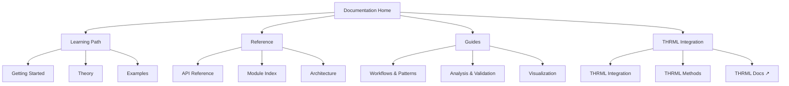

# Documentation

> **Quick Start**: [Getting Started](getting_started.md) | [Architecture](architecture.md) | [API Reference](api.md) | [Theory](theory.md)

## Navigation Map

## Overview

The `docs` module contains comprehensive documentation for the active inference library, including API references, tutorials, theoretical background, and integration guides.

## Documentation Files

### `getting_started.md`
Quick start guide covering:
- Installation
- Basic usage
- First examples
- Common patterns

### `api.md`
API reference documenting:
- Core components
- Inference engines
- Agents
- Environments
- Utilities
- Statistical analysis
- Validation
- Resource tracking

### `theory.md`
Theoretical background covering:
- Free Energy Principle
- Variational inference
- Expected free energy
- Active inference theory

### `analysis_validation.md`
Analysis and validation features:
- Statistical analysis (regression, correlation, tests)
- Data validation
- Resource tracking
- Enhanced visualization

**See**: [Analysis & Validation](analysis_validation.md)

---

## Complete Module Documentation

### Core Modules
- [`module_core.md`](module_core.md) - GenerativeModel, Free Energy, Precision
- [`module_inference.md`](module_inference.md) - State inference engines
- [`module_agents.md`](module_agents.md) - Active inference agents

### Application Modules
- [`module_models.md`](module_models.md) - Pre-built model builders
- [`module_environments.md`](module_environments.md) - Test environments

### Utility Modules
- [`module_utils.md`](module_utils.md) - Metrics, validation, statistics
- [`module_visualization.md`](module_visualization.md) - Advanced plotting

---

## Integration Documentation

### THRML Integration
- [`thrml_integration.md`](thrml_integration.md) - Complete THRML integration guide
- Detailed method documentation for all THRML components
- Factor construction patterns
- Sampling workflows
- Performance comparisons

**Link to Parent**: [THRML Main Documentation](../../docs/index.md)

---

## Practical Guides

### Workflows and Patterns
- [`workflows_patterns.md`](workflows_patterns.md) - Common patterns and best practices
- Setup and installation
- Training loops
- Evaluation pipelines
- Optimization techniques
- Debugging strategies

### Architecture
- [`architecture.md`](architecture.md) - System design and structure
- Component relationships
- Data flow diagrams
- Integration points
- Extension guidelines

---

## Navigation Tools

### Quick Reference
- [`module_index.md`](module_index.md) - Complete module index with cross-references
- Navigate by module, task, or use case
- Dependency diagrams
- THRML integration points

### API Reference
- [`api.md`](api.md) - Quick API reference
- All classes and functions
- Parameter descriptions
- Usage examples

---

## THRML Integration Documentation

### Current Documentation
- Standard usage patterns
- Variational inference approaches
- THRML component reference
- Integration patterns
- Performance guidelines

### Comprehensive Coverage
- **Block Management**: `Block`, `BlockSpec`, utilities
- **Sampling**: `sample_states`, `BlockGibbsSpec`, schedules
- **Factors**: `AbstractFactor`, `WeightedFactor`, construction
- **Conditionals**: Categorical samplers, custom samplers
- **Observers**: `StateObserver`, `MomentAccumulatorObserver`
- **PGM Nodes**: `CategoricalNode`, `SpinNode`

**See**: [THRML Integration Guide](thrml_integration.md)

---

## Design Principles

1. **Comprehensive**: Cover all major features
2. **Clear**: Easy to understand
3. **Examples**: Include code examples
4. **Accurate**: Keep documentation up to date
5. **Accessible**: Multiple entry points for different users

## Documentation Structure

### Getting Started
- Installation instructions
- Quick examples
- Basic concepts
- First agent tutorial

### API Reference
- Function signatures
- Parameter descriptions
- Return values
- Usage examples

### Theory
- Mathematical foundations
- Key concepts
- References

### Module Documentation
- Detailed API for each module
- Usage patterns
- Integration points
- Cross-references

### Guides
- Workflows and patterns
- Performance optimization
- Debugging strategies
- Best practices

## THRML Integration Documentation

### Current Documentation
- Standard usage patterns
- Variational inference approaches

### Future Documentation
- THRML integration guide
- THRML factor construction
- THRML sampling examples
- THRML performance guide

## Design Principles

1. **Comprehensive**: Cover all major features
2. **Clear**: Easy to understand
3. **Examples**: Include code examples
4. **Accurate**: Keep documentation up to date
5. **Accessible**: Multiple entry points for different users

## Documentation Structure

### Getting Started
- Installation instructions
- Quick examples
- Basic concepts

### API Reference
- Function signatures
- Parameter descriptions
- Return values
- Usage examples

### Theory
- Mathematical foundations
- Key concepts
- References

## Maintenance

- Keep documentation synchronized with code
- Update examples when APIs change
- Add new documentation for new features
- Review documentation regularly
- Maintain cross-references
- Update navigation links

---

## Quick Links by Task

### I want to...

**Get Started**
- Install and run first example → [Getting Started](getting_started.md)
- Understand the theory → [Theory](theory.md)
- See code examples → [Examples](../examples/INDEX.md)

**Build Something**
- Create an agent → [Workflows: First Agent](workflows_patterns.md#creating-your-first-agent)
- Build custom model → [Custom Models](custom_models.md)
- Make custom environment → [Custom Environments](custom_environments.md)

**Integrate THRML**
- Understand integration → [THRML Integration](thrml_integration.md)
- Use THRML sampling → [THRML Inference](module_inference.md#thrml-inference)
- Create THRML factors → [THRML Factors](thrml_integration.md#factors)

**Optimize & Debug**
- Improve performance → [Performance Guide](performance.md)
- Validate my code → [Validation Workflow](workflows_patterns.md#validation-workflow)
- Debug issues → [Debugging Patterns](workflows_patterns.md#debugging-patterns)

**Understand the Code**
- System architecture → [Architecture](architecture.md)
- Module details → [Module Index](module_index.md)
- API reference → [API Reference](api.md)

---

## External Documentation Links

### THRML Library
- [THRML Main Documentation](../../docs/index.md)
- [THRML Architecture](../../docs/architecture.md)
- [THRML API](../../docs/api/)

### Active Inference Resources
- [Active Inference Textbook](https://mitpress.mit.edu/9780262045353/) - Parr, Pezzulo, & Friston (2022)
- [Free Energy Principle Papers](https://www.fil.ion.ucl.ac.uk/~karl/) - Karl Friston's work
- [JAX Documentation](https://jax.readthedocs.io/) - JAX library

---

## Documentation Statistics

- **Total Documentation Files**: 20+
- **Module References**: 7 (core, inference, agents, models, environments, utils, visualization)
- **Examples**: 13 (01-13)
- **Tests**: 5 test modules
- **Lines of Documentation**: 10,000+

---

> **Start Here**: [Getting Started](getting_started.md) | **Dive Deep**: [Module Index](module_index.md) | **Integrate**: [THRML Guide](thrml_integration.md)
