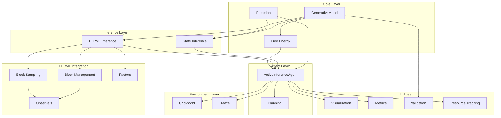
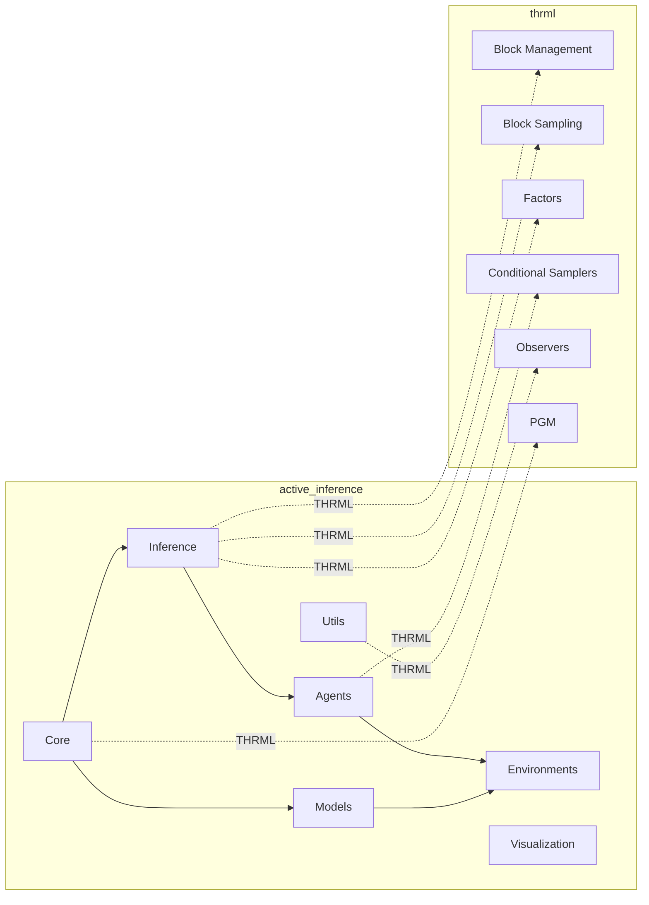
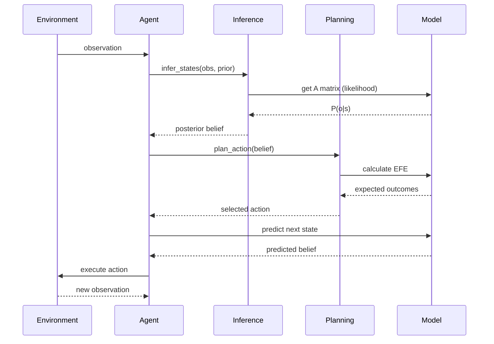
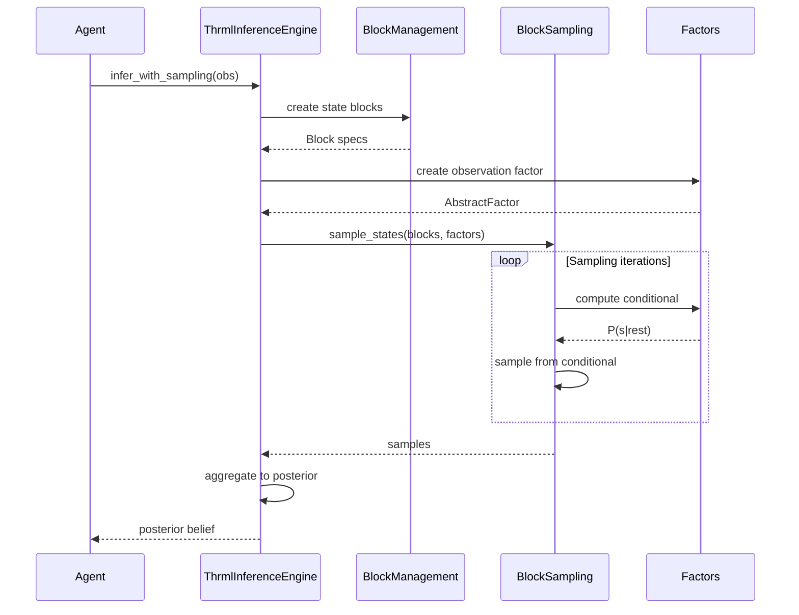
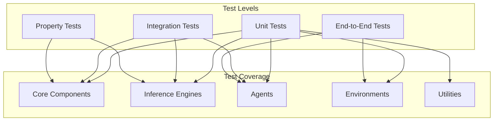

# Active Inference Architecture

## Overview

This document provides a comprehensive architectural overview of the active_inference library, including system design, component relationships, and integration with THRML.

## System Architecture



## Component Hierarchy



## Module Organization

### Core Modules (`active_inference.core`)

**Purpose**: Fundamental mathematical components for active inference

**Components**:
- `generative_model.py`: POMDP-based generative models
- `free_energy.py`: Variational and expected free energy calculations
- `precision.py`: Precision weighting and message passing

**Key Classes**:
- `GenerativeModel`: Encodes beliefs about world dynamics
- `Precision`: Controls information weighting
- `Message`: Message passing infrastructure

**See**: [Core Module Documentation](module_core.md) | [API Reference](api.md#core-components)

### Inference Modules (`active_inference.inference`)

**Purpose**: State inference engines for perception

**Components**:
- `state_inference.py`: Variational message passing
- `thrml_inference.py`: THRML-based sampling inference

**Key Classes**:
- `ThrmlInferenceEngine`: Sampling-based inference engine

**Key Functions**:
- `infer_states()`: Fixed-point variational inference
- `variational_message_passing()`: Sequential inference

**See**: [Inference Module Documentation](module_inference.md) | [THRML Integration Guide](thrml_integration.md)

### Agent Modules (`active_inference.agents`)

**Purpose**: Complete perception-action agents

**Components**:
- `base_agent.py`: Core agent implementation
- `planning.py`: Action planning and policy evaluation

**Key Classes**:
- `ActiveInferenceAgent`: Main perception-action loop
- `AgentState`: Agent internal state tracking

**Key Functions**:
- `plan_action()`: Single-step action planning
- `plan_with_tree_search()`: Multi-step tree search
- `evaluate_policy()`: Policy evaluation via EFE

**See**: [Agent Module Documentation](module_agents.md) | [Planning Algorithms](planning_algorithms.md)

### Model Modules (`active_inference.models`)

**Purpose**: Pre-built generative models for common tasks

**Components**:
- `discrete_mdp.py`: Discrete MDP model builders

**Key Functions**:
- `build_grid_world_model()`: Grid navigation model
- `build_tmaze_model()`: T-maze decision model

**See**: [Model Module Documentation](module_models.md) | [Building Custom Models](custom_models.md)

### Environment Modules (`active_inference.environments`)

**Purpose**: Test environments for agent evaluation

**Components**:
- `grid_world.py`: 2D grid navigation
- `tmaze.py`: T-maze decision task

**Key Classes**:
- `GridWorld`: Configurable grid environment
- `GridWorldConfig`: Grid configuration
- `TMaze`: T-maze environment

**See**: [Environment Module Documentation](module_environments.md) | [Custom Environments](custom_environments.md)

### Utility Modules (`active_inference.utils`)

**Purpose**: Analysis, validation, and visualization tools

**Components**:
- `metrics.py`: Performance metrics and KL divergence
- `statistical_analysis.py`: Regression, correlation, tests
- `validation.py`: Data and model validation
- `resource_tracking.py`: Resource monitoring
- `visualization.py`: Basic plotting utilities

**See**: [Utils Module Documentation](module_utils.md) | [Analysis & Validation](analysis_validation.md)

### Visualization Modules (`active_inference.visualization`)

**Purpose**: Advanced plotting and animation

**Components**:
- `core.py`: Core plotting infrastructure
- `active_inference_plots.py`: Beliefs, free energy plots
- `environment_plots.py`: Environment visualization
- `statistical_plots.py`: Statistical visualizations
- `comparison_plots.py`: Comparative analysis plots
- `network_plots.py`: Network structure plots
- `thrml_plots.py`: THRML-specific visualizations
- `animation.py`: Animated visualizations

**See**: [Visualization Module Documentation](module_visualization.md)

## Data Flow

### Perception-Action Cycle



### THRML Sampling Flow



## Design Patterns

### 1. Generative Model Pattern

```python
# Create model with explicit matrices
model = GenerativeModel(
    n_states=N, n_observations=M, n_actions=K,
    A=likelihood_matrix,  # [M, N]
    B=transition_tensor,  # [N, N, K]
    C=preferences,        # [M]
    D=prior               # [N]
)

# Or use builders
from active_inference.models import build_grid_world_model
model = build_grid_world_model(config)
```

**See**: [Generative Models Guide](generative_models.md)

### 2. Inference Pattern

```python
# Variational inference (fast, approximate)
from active_inference.inference import infer_states
posterior, fe = infer_states(obs, prior, model, n_iterations=16)

# THRML sampling (slower, accurate)
from active_inference.inference import ThrmlInferenceEngine
engine = ThrmlInferenceEngine(model, n_samples=1000)
posterior = engine.infer_with_sampling(key, obs)
```

**See**: [Inference Methods Guide](inference_methods.md) | [THRML Integration](thrml_integration.md)

### 3. Agent Pattern

```python
# Create and run agent
agent = ActiveInferenceAgent(
    model=model,
    precision=precision,
    planning_horizon=3
)

agent_state = agent.reset()
for step in range(max_steps):
    action, agent_state, fe = agent.step(key, obs, agent_state)
    obs, reward, done = env.step(key, action)
```

**See**: [Agent Usage Guide](agent_usage.md)

### 4. THRML Integration Pattern

```python
# Use THRML blocks for states
from thrml import Block, CategoricalNode
state_block = Block(
    nodes=[CategoricalNode(n_categories=n_states)],
    name="states"
)

# Use THRML factors for likelihood
from thrml import AbstractFactor, FactorSamplingProgram
obs_factor = create_observation_factor(model.A, obs)

# Sample with THRML
from thrml import sample_states, BlockGibbsSpec
spec = BlockGibbsSpec(free=[state_block], clamped=[])
samples = sample_states(key, spec, factors, n_samples=1000)
```

**See**: [THRML Integration Guide](thrml_integration.md)

## Integration Points

### Active Inference ↔ THRML

| Active Inference Component | THRML Component | Integration Status |
|---------------------------|-----------------|-------------------|
| State beliefs | `CategoricalNode` | ✅ Implemented |
| Observation likelihood | `AbstractFactor` | ⚠️ Template ready |
| State transitions | `AbstractFactor` | 🔄 Planned |
| Sampling inference | `sample_states()` | ✅ Implemented |
| Block management | `Block`, `BlockSpec` | ✅ Implemented |
| Monitoring | `AbstractObserver` | 🔄 Planned |
| Batch processing | Batch sampling | 🔄 Planned |

**Legend**: ✅ Complete | ⚠️ Partial | 🔄 Planned

**See**: [Integration Roadmap](integration_roadmap.md)

## Performance Considerations

### When to Use Each Approach

| Scenario | Recommended Approach | Reason |
|----------|---------------------|---------|
| Small state space (< 100 states) | Variational inference | Fast, exact enough |
| Large state space (> 100 states) | THRML sampling | Scales better |
| Real-time control | Variational inference | Low latency |
| Offline analysis | THRML sampling | Higher accuracy |
| Hierarchical models | THRML sampling | Better for complex dependencies |
| Simple POMDPs | Variational inference | Simpler implementation |

**See**: [Performance Guide](performance.md)

## Testing Architecture



**See**: [Testing Guide](testing_guide.md)

## Directory Structure

```
active_inference/
├── src/active_inference/        # Main package
│   ├── core/                    # Core components
│   ├── inference/               # Inference engines
│   ├── agents/                  # Agent implementations
│   ├── models/                  # Model builders
│   ├── environments/            # Test environments
│   ├── utils/                   # Utilities
│   └── visualization/           # Visualization
├── tests/                       # Test suite
│   ├── test_core.py
│   ├── test_inference.py
│   ├── test_agents.py
│   ├── test_environments.py
│   └── test_integration.py
├── examples/                    # Example scripts
│   ├── 01_basic_inference.py
│   ├── 02_grid_world_agent.py
│   └── ...
├── docs/                        # Documentation
│   ├── getting_started.md
│   ├── api.md
│   ├── theory.md
│   └── ...
└── scripts/                     # Development scripts
    ├── setup.sh
    ├── check.sh
    └── ...
```

## Extension Points

### Adding New Components

1. **New Inference Method**: Extend in `inference/` module
2. **New Planning Algorithm**: Add to `agents/planning.py`
3. **New Environment**: Implement in `environments/`
4. **New Model Builder**: Add to `models/`
5. **New Visualization**: Add to `visualization/`

**See**: [Extension Guide](extension_guide.md)

## Cross-References

- [Getting Started Guide](getting_started.md) - Quick start
- [API Reference](api.md) - Complete API documentation
- [Theory Guide](theory.md) - Theoretical background
- [THRML Integration](thrml_integration.md) - THRML integration details
- [Examples Index](../examples/INDEX.md) - Example code
- [Module References](module_index.md) - Detailed module docs

## Related Documentation

### THRML Documentation
- [THRML Main Docs](../../docs/index.md)
- [THRML Block Management](thrml_blocks.md)
- [THRML Sampling](thrml_sampling.md)
- [THRML Factors](thrml_factors.md)

### Active Inference Resources
- [Active Inference Textbook](https://mitpress.mit.edu/9780262045353/)
- [Free Energy Principle Papers](https://www.fil.ion.ucl.ac.uk/~karl/)
