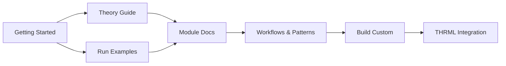

# Getting Started with Active Inference + THRML

> **Navigation**: [Home](README.md) | [Architecture](architecture.md) | [API Reference](api.md) | [Theory](theory.md) | [Module Index](module_index.md) | [Workflows](workflows_patterns.md)

This guide will help you get started with the active inference implementation using THRML.

## Quick Links

- 📦 [Installation](#installation)
- 🚀 [Quick Start](#quick-start)
- 📖 [Core Concepts](#core-concepts)
- 🧪 [Running Tests](#running-tests)
- 📚 [Examples](#examples)

## Installation

Requires [uv](https://github.com/astral-sh/uv) for fast, reliable package management.

```bash
# Navigate to the active_inference directory
cd active_inference

# Run the setup script (installs uv if needed)
./scripts/setup.sh

# Or manually:
uv venv
source .venv/bin/activate  # On Windows: .venv\Scripts\activate
uv pip install -e ".[all]"
```

## Quick Start

### 1. Basic Inference

```python
import jax
import jax.numpy as jnp
from active_inference.core import GenerativeModel
from active_inference.inference import infer_states

# Create a simple model
model = GenerativeModel(
    n_states=4,
    n_observations=4,
    n_actions=2,
)

# Perform inference
key = jax.random.key(42)
observation = 0
prior = model.D

posterior, free_energy = infer_states(observation, prior, model)
print(f"Posterior: {posterior}")
```

### 2. Active Inference Agent

```python
from active_inference.agents import ActiveInferenceAgent
from active_inference.environments import GridWorld
from active_inference.models import build_grid_world_model

# Create environment
env = GridWorld(size=5)

# Build matching generative model
model = build_grid_world_model(env.config)

# Create agent
agent = ActiveInferenceAgent(
    model=model,
    planning_horizon=3,
)

# Run perception-action loop
agent_state = agent.reset()
key = jax.random.key(42)
obs = env.reset(key)

action, agent_state, free_energy = agent.step(key, obs, agent_state)
```

## Core Concepts

### Generative Models

Generative models encode the agent's beliefs about how the world works:

- **A matrix**: How states cause observations
- **B tensor**: How actions cause state transitions
- **C vector**: Which observations are preferred (goals)
- **D vector**: Initial beliefs about states

### Free Energy

Two types of free energy guide behavior:

1. **Variational Free Energy (VFE)**: Guides perception
   - Lower VFE = better inference
   - Minimized by updating beliefs

2. **Expected Free Energy (EFE)**: Guides action
   - Lower EFE = better action
   - Combines pragmatic (goal-seeking) and epistemic (info-seeking) value

### Precision

Precision controls the influence of different information sources:

- **Sensory precision**: Trust in observations
- **State precision**: Trust in state predictions
- **Action precision**: Decisiveness (exploration vs exploitation)

## Running Tests

```bash
# Run all tests
pytest tests/ -v

# Run with coverage
pytest tests/ --cov=active_inference --cov-report=html

# Run specific test file
pytest tests/test_core.py -v

# Run specific test
pytest tests/test_core.py::TestGenerativeModel::test_model_initialization -v
```

## Examples

### Example 1: Basic Inference

```bash
python3 examples/01_basic_inference.py
```

This example demonstrates:
- Creating a simple generative model
- Performing state inference from observations
- Understanding variational free energy

### Example 2: Grid World Navigation

```bash
python3 examples/02_grid_world_agent.py
```

This example demonstrates:
- Creating a grid world environment
- Building a matching generative model
- Running an active inference agent
- Goal-directed navigation

### Example 3: Precision Control

```bash
python3 examples/03_precision_control.py
```

This example demonstrates:
- How precision controls exploration vs exploitation
- Comparing low, medium, and high precision agents
- Understanding action selection strategies

## Development Workflow

### 1. Setup Development Environment

```bash
./scripts/setup.sh
```

### 2. Make Changes

Edit source files in `src/active_inference/`

### 3. Run Tests

```bash
pytest tests/ -v
```

### 4. Format Code

```bash
./scripts/format.sh
```

### 5. Run All Checks

```bash
./scripts/check.sh
```

This runs:
- pytest with coverage
- black formatter check
- isort import sorting check
- ruff linter
- pyright type checker

## Project Structure

```
active_inference/
├── src/active_inference/      # Main package
│   ├── core/                  # Core components
│   │   ├── generative_model.py
│   │   ├── free_energy.py
│   │   └── precision.py
│   ├── inference/             # Inference engines
│   │   ├── state_inference.py
│   │   └── thrml_inference.py
│   ├── agents/                # Agent implementations
│   │   ├── base_agent.py
│   │   └── planning.py
│   ├── environments/          # Test environments
│   │   ├── grid_world.py
│   │   └── tmaze.py
│   ├── models/                # Model builders
│   │   └── discrete_mdp.py
│   └── utils/                 # Utilities
│       ├── metrics.py
│       └── visualization.py
├── tests/                     # Test suite
│   ├── test_core.py
│   ├── test_inference.py
│   ├── test_agents.py
│   ├── test_environments.py
│   └── test_integration.py
├── examples/                  # Example scripts
├── docs/                      # Documentation
│   ├── theory.md             # Theoretical background
│   └── api.md                # API reference
└── scripts/                   # Development scripts
    ├── setup.sh
    ├── check.sh
    └── format.sh
```

## Key Features

### 1. Modular Design

Each component is independently testable and reusable:
- Core: Free energy calculations, generative models
- Inference: State inference engines
- Agents: Complete active inference agents
- Environments: Test environments

### 2. THRML Integration

Uses THRML for efficient probabilistic inference:
- GPU-accelerated sampling
- Block Gibbs sampling
- Energy-based formulation
- Compatible with future Extropic hardware

### 3. Test-Driven Development

Comprehensive test coverage:
- Unit tests for each module
- Integration tests for component interactions
- Property-based tests with hypothesis
- No mocks—real JAX operations

### 4. Professional Tooling

Modern Python development tools:
- uv for fast package management
- pytest for testing
- black + isort for formatting
- ruff for linting
- pyright for type checking

## Common Patterns

### Creating a Custom Generative Model

```python
import jax.numpy as jnp
from active_inference.core import GenerativeModel

# Define observation likelihood
A = jnp.array([[0.9, 0.1],
               [0.1, 0.9]])  # [n_obs, n_states]

# Define state transitions
B = jnp.zeros((2, 2, 2))  # [n_states, n_states, n_actions]
B = B.at[1, 0, 0].set(1.0)  # Action 0: state 0 -> 1
B = B.at[0, 0, 1].set(1.0)  # Action 1: stay at 0
# ... set other transitions

# Define preferences
C = jnp.array([0.0, 2.0])  # Prefer observation 1

# Define prior
D = jnp.array([0.5, 0.5])

model = GenerativeModel(
    n_states=2,
    n_observations=2,
    n_actions=2,
    A=A, B=B, C=C, D=D,
)
```

### Custom Inference Loop

```python
from active_inference.inference import infer_states

observations = [0, 1, 1, 0]
beliefs = []
current_belief = model.D

for obs in observations:
    posterior, fe = infer_states(obs, current_belief, model)
    beliefs.append(posterior)
    current_belief = posterior
```

### Batch Processing

```python
import jax

# Create multiple agents/environments
def run_episode(key, agent, env):
    # ... episode logic
    return total_reward

keys = jax.random.split(jax.random.key(42), 100)
rewards = jax.vmap(lambda k: run_episode(k, agent, env))(keys)
```

## Troubleshooting

### Import Errors

Ensure the package is installed in development mode:

```bash
uv pip install -e .
```

### JAX Errors

Update JAX to the latest version:

```bash
uv pip install --upgrade jax jaxlib
```

### Test Failures

Run tests with verbose output:

```bash
pytest tests/ -vv --tb=long
```

## Next Steps

### Learning Path



1. **Understand Theory**: Read the [theoretical background](theory.md)
2. **Explore API**: Review the [API reference](api.md)
3. **Run Examples**: Execute examples in `examples/` directory
4. **Study Modules**: Dive into [module documentation](module_index.md)
5. **Follow Workflows**: Use [workflow patterns](workflows_patterns.md)
6. **Build Custom**: Create [custom models](custom_models.md) and [environments](custom_environments.md)
7. **Integrate THRML**: Advanced [THRML integration](thrml_integration.md)

### Documentation Navigation

- **Core Concepts**: [Core Module](module_core.md) | [Inference](module_inference.md) | [Agents](module_agents.md)
- **Practical Guides**: [Workflows](workflows_patterns.md) | [Performance](performance.md) | [Debugging](workflows_patterns.md#debugging-patterns)
- **Integration**: [THRML Guide](thrml_integration.md) | [THRML Methods](thrml_integration.md#thrml-components-reference)
- **Analysis**: [Validation](analysis_validation.md) | [Visualization](module_visualization.md)

## Resources

### Documentation
- 📘 [Active Inference Theory](theory.md) - Mathematical foundations
- 🏗️ [Architecture Guide](architecture.md) - System design
- 📊 [Analysis & Validation](analysis_validation.md) - Statistical tools
- 🔧 [THRML Integration](thrml_integration.md) - THRML methods reference

### External Resources
- [THRML Documentation](../../docs/index.md) - Parent THRML library
- [Active Inference Textbook](https://mitpress.mit.edu/9780262045353/) - Parr, Pezzulo, & Friston (2022)
- [Free Energy Principle](https://www.fil.ion.ucl.ac.uk/~karl/) - Karl Friston's work
- [JAX Documentation](https://jax.readthedocs.io/) - JAX library

### Examples
- [Example Index](../examples/INDEX.md) - All examples
- [Basic Examples](../examples/) - 01-06: Fundamentals
- [Advanced Examples](../examples/) - 07-13: Advanced topics

## Support

For issues or questions:

1. **Check Documentation**:
   - Start with [Getting Started](getting_started.md)
   - Search [Module Index](module_index.md)
   - Review [Workflows & Patterns](workflows_patterns.md)

2. **Explore Examples**:
   - Run relevant examples from `examples/`
   - Review test files in `tests/` for usage patterns

3. **Validate Your Setup**:
   - Use [DataValidator](module_utils.md#validation) for model checking
   - Check [Resource Tracking](module_utils.md#resource-tracking) for performance

4. **Get Help**:
   - Open an issue on GitHub
   - Check existing issues for solutions

---

> **Next**: [Theory Guide](theory.md) | [Architecture](architecture.md) | [Core Module](module_core.md)
