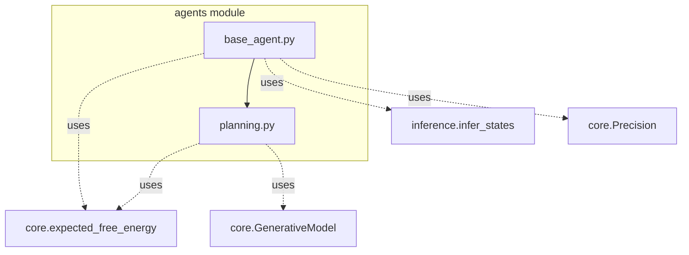
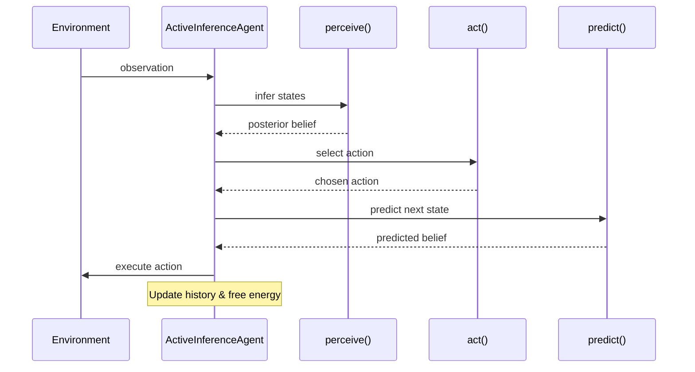
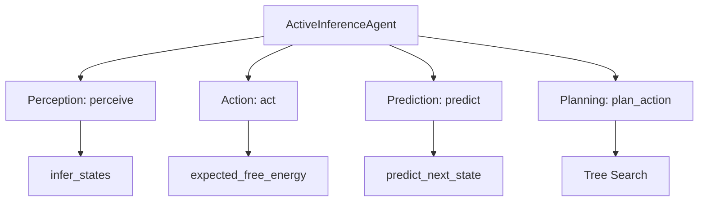
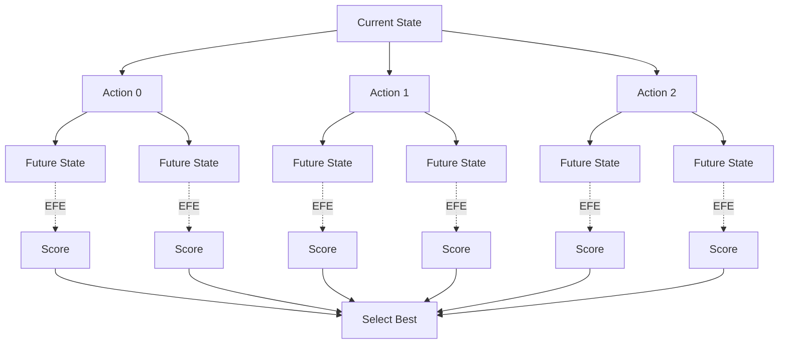

# Agent Module Documentation

## Overview

The `agents` module implements complete active inference agents that integrate perception (state inference) and action (policy selection) into a unified perception-action loop based on the Free Energy Principle.

## Module Structure



## Perception-Action Loop



## Components

### Base Agent (`base_agent.py`)

#### `AgentState`

**Purpose**: Internal state tracking for active inference agents

**Attributes**:
```python
belief: Array[n_states]                  # Current posterior belief Q(s)
observation_history: List[int]           # Observed indices
action_history: List[int]                # Actions taken
free_energy_history: Array[history_len]  # FE trajectory
```

**Usage**:
```python
from active_inference.agents import AgentState
import jax.numpy as jnp

state = AgentState(
    belief=jnp.array([0.25, 0.25, 0.25, 0.25]),
    observation_history=[],
    action_history=[],
    free_energy_history=jnp.array([])
)
```

**Purpose in Agent**: Track internal state across timesteps

---

#### `ActiveInferenceAgent`

**Purpose**: Complete active inference agent with perception-action cycle

**Architecture**:


**Attributes**:
```python
model: GenerativeModel              # World model
precision: Precision                # Precision parameters
planning_horizon: int = 1           # Lookahead steps
inference_iterations: int = 16      # Iterations for perception
use_tree_search: bool = False       # Enable tree search planning
```

**Initialization**:
```python
from active_inference.agents import ActiveInferenceAgent
from active_inference.core import GenerativeModel, Precision

model = GenerativeModel(n_states=10, n_observations=8, n_actions=4)
precision = Precision(sensory_precision=1.0, action_precision=2.0)

agent = ActiveInferenceAgent(
    model=model,
    precision=precision,
    planning_horizon=3,
    inference_iterations=16
)
```

---

#### `ActiveInferenceAgent.perceive(observation, prior_belief)`

**Purpose**: Perception - infer hidden states from observation

**Algorithm**:
```
Input: observation, prior_belief
1. Call infer_states(obs, prior, model)
2. Return posterior belief and free energy
```

**Parameters**:
- `observation: int` - Observed index
- `prior_belief: Array[n_states]` - Prior belief distribution

**Returns**:
- `posterior: Array[n_states]` - Updated belief Q(s|o)
- `free_energy: float` - Variational free energy

**Example**:
```python
observation = 3
prior = model.D

posterior, fe = agent.perceive(observation, prior)
print(f"Posterior: {posterior}")
print(f"Free Energy: {fe:.3f}")
```

**Theoretical Basis**: Minimizes variational free energy \( F = E_Q[\log Q(s) - \log P(o,s)] \)

**See**: [Inference Module](module_inference.md) | [Theory](theory.md#perception-as-inference)

---

#### `ActiveInferenceAgent.act(key, state_belief)`

**Purpose**: Action selection - choose action minimizing expected free energy

**Algorithm**:
```
Input: state_belief
1. For each action a:
   a. Compute expected_free_energy(belief, a, model)
2. Apply precision-weighted softmax: P(a) ∝ exp(-β·G(a))
3. Sample action from distribution
```

**Parameters**:
- `key: PRNGKey` - JAX random key
- `state_belief: Array[n_states]` - Current belief

**Returns**:
- `action: int` - Selected action index

**Example**:
```python
import jax

key = jax.random.key(42)
belief = agent_state.belief

action = agent.act(key, belief)
print(f"Selected action: {action}")
```

**Action Distribution**:
```python
# Get action probabilities without sampling
action_probs = agent.get_action_distribution(belief)
print(f"Action probabilities: {action_probs}")
```

**Theoretical Basis**: Minimizes expected free energy \( G(\pi) = E_{Q(o,s'|\pi)}[\log Q(s'|\pi) - \log P(o,s')] \)

**Exploration vs Exploitation**:
- High action_precision → More deterministic (exploitation)
- Low action_precision → More stochastic (exploration)

**See**: [Planning](planning_algorithms.md) | [Precision Control](precision_control.md)

---

#### `ActiveInferenceAgent.step(key, observation, agent_state)`

**Purpose**: Complete perception-action cycle for one timestep

**Algorithm**:
```
Input: observation, agent_state
1. Perceive: posterior, fe = perceive(obs, agent_state.belief)
2. Act: action = act(key, posterior)
3. Predict: next_belief = predict_next_state(posterior, action)
4. Update: Add to history
5. Return: action, new_agent_state, fe
```

**Parameters**:
- `key: PRNGKey` - JAX random key
- `observation: int` - Current observation
- `agent_state: AgentState` - Current agent state

**Returns**:
- `action: int` - Selected action
- `new_agent_state: AgentState` - Updated state
- `free_energy: float` - Free energy

**Example**:
```python
import jax
from active_inference.environments import GridWorld

# Setup
env = GridWorld(size=5)
agent_state = agent.reset()
key = jax.random.key(42)

# Run episode
total_reward = 0
for step in range(100):
    obs = env.get_observation(env.state)

    # Perception-action cycle
    action, agent_state, fe = agent.step(key, obs, agent_state)

    # Environment step
    key, subkey = jax.random.split(key)
    new_state, reward, done = env.step(subkey, action)

    total_reward += reward

    print(f"Step {step}: obs={obs}, action={action}, fe={fe:.3f}, reward={reward}")

    if done:
        break

print(f"Total reward: {total_reward}")
```

**See**: [Getting Started](getting_started.md#active-inference-agent) | [Example 02](../examples/02_grid_world_agent.py)

---

#### `ActiveInferenceAgent.reset()`

**Purpose**: Reset agent to initial state

**Returns**:
- `agent_state: AgentState` - Fresh state with initial belief

**Example**:
```python
agent_state = agent.reset()
print(f"Initial belief: {agent_state.belief}")
```

---

#### `ActiveInferenceAgent.get_action_distribution(state_belief)`

**Purpose**: Get action probability distribution without sampling

**Parameters**:
- `state_belief: Array[n_states]` - Current belief

**Returns**:
- `action_dist: Array[n_actions]` - Action probabilities

**Example**:
```python
action_probs = agent.get_action_distribution(belief)

# Visualize action preferences
import matplotlib.pyplot as plt
plt.bar(range(len(action_probs)), action_probs)
plt.xlabel("Action")
plt.ylabel("Probability")
plt.title("Action Distribution")
plt.show()
```

**Use Cases**:
- Analyzing agent behavior
- Debugging action selection
- Policy visualization

---

### Planning (`planning.py`)

Advanced planning algorithms for action selection.

#### `plan_action(state_belief, model, precision)`

**Purpose**: Greedy single-step action planning

**Algorithm**:
```
1. Compute EFE for all actions
2. Select action with minimum EFE
```

**Parameters**:
- `state_belief: Array[n_states]` - Current belief
- `model: GenerativeModel` - World model
- `precision: Precision` - Precision parameters

**Returns**:
- `best_action: int` - Action minimizing EFE

**Example**:
```python
from active_inference.agents import plan_action

action = plan_action(belief, model, precision)
print(f"Planned action: {action}")
```

**Use Case**: Fast deterministic planning

---

#### `plan_with_tree_search(key, state_belief, model, horizon, n_samples)`

**Purpose**: Multi-step tree search planning

**Algorithm**:
```
For each action sequence of length horizon:
    1. Simulate trajectory
    2. Compute cumulative expected free energy
    3. Weight by probability
Select best action sequence
Return first action
```

**Parameters**:
- `key: PRNGKey` - Random key
- `state_belief: Array[n_states]` - Current belief
- `model: GenerativeModel` - World model
- `horizon: int` - Planning depth
- `n_samples: int` - Trajectory samples

**Returns**:
- `best_action: int` - First action of best sequence

**Example**:
```python
from active_inference.agents import plan_with_tree_search
import jax

key = jax.random.key(42)

action = plan_with_tree_search(
    key=key,
    state_belief=belief,
    model=model,
    horizon=3,
    n_samples=100
)

print(f"Planned action (3-step lookahead): {action}")
```

**Visualization**:


**Computational Cost**:
- Time complexity: O(n_actions^horizon × n_samples)
- Memory: O(n_samples × horizon)

**Use Cases**:
- Complex decision tasks
- Long-term planning
- Strategic behavior

**See**: [Planning Algorithms](planning_algorithms.md)

---

#### `evaluate_policy(policy, state_belief, model)`

**Purpose**: Evaluate policy (action sequence) via expected free energy

**Parameters**:
- `policy: Array[T]` - Action sequence
- `state_belief: Array[n_states]` - Starting belief
- `model: GenerativeModel` - World model

**Returns**:
- `total_efe: float` - Cumulative expected free energy

**Example**:
```python
from active_inference.agents import evaluate_policy

# Compare two policies
policy_1 = jnp.array([0, 1, 0])
policy_2 = jnp.array([1, 0, 1])

efe_1 = evaluate_policy(policy_1, belief, model)
efe_2 = evaluate_policy(policy_2, belief, model)

if efe_1 < efe_2:
    print("Policy 1 is better")
else:
    print("Policy 2 is better")
```

**Use Cases**:
- Policy comparison
- Trajectory optimization
- Reinforcement learning integration

---

## Usage Patterns

### Pattern 1: Basic Agent

```python
from active_inference.agents import ActiveInferenceAgent
from active_inference.core import GenerativeModel, Precision
from active_inference.environments import GridWorld

# Create components
model = GenerativeModel(n_states=25, n_observations=10, n_actions=4)
precision = Precision(action_precision=2.0)
agent = ActiveInferenceAgent(model, precision)

# Run agent
env = GridWorld(size=5)
agent_state = agent.reset()
obs = env.reset(key)

for _ in range(100):
    action, agent_state, fe = agent.step(key, obs, agent_state)
    obs, reward, done = env.step(key, action)
    if done:
        break
```

### Pattern 2: Agent with Tree Search

```python
agent = ActiveInferenceAgent(
    model=model,
    precision=precision,
    planning_horizon=3,
    use_tree_search=True
)
```

### Pattern 3: Custom Perception-Action

```python
# Custom perception
posterior, fe = agent.perceive(obs, prior_belief)

# Custom action selection
action_probs = agent.get_action_distribution(posterior)
action = jnp.argmax(action_probs)  # Greedy

# Predict next state
next_belief = agent.model.predict_next_state(posterior, action)
```

### Pattern 4: Batch Agents

```python
import jax

# Vectorize over multiple agents
def run_episode(key):
    agent_state = agent.reset()
    total_reward = 0
    for _ in range(100):
        action, agent_state, _ = agent.step(key, obs, agent_state)
        # ... environment interaction
    return total_reward

keys = jax.random.split(key, 100)
rewards = jax.vmap(run_episode)(keys)
print(f"Mean reward: {rewards.mean()}")
```

---

## Integration with THRML

### Current Integration
- Uses variational inference for perception
- Direct EFE calculation for action

### Future Integration

#### THRML-based Perception
```python
from active_inference.inference import ThrmlInferenceEngine

engine = ThrmlInferenceEngine(model)

# Replace perceive() with THRML sampling
posterior = engine.infer_with_sampling(key, observation)
```

#### THRML-based Planning
```python
# Sample trajectories for planning
trajectories = engine.sample_trajectory(key, policy, n_samples=100)

# Evaluate policy under uncertainty
efe_samples = [evaluate_trajectory(traj) for traj in trajectories]
expected_efe = jnp.mean(jnp.array(efe_samples))
```

**See**: [THRML Integration](thrml_integration.md)

---

## Performance Considerations

### Computational Bottlenecks

| Component | Complexity | Optimization |
|-----------|-----------|--------------|
| Perception (variational) | O(n_iterations × n_states) | Reduce iterations |
| Perception (THRML) | O(n_samples × n_states) | Reduce samples |
| Action selection | O(n_actions × n_states²) | Cache transitions |
| Tree search | O(n_actions^horizon) | Reduce horizon |

### Optimization Tips

1. **Reduce inference iterations** (if convergence fast)
2. **Cache model predictions** (if deterministic)
3. **Use tree search selectively** (only for critical decisions)
4. **Vectorize over actions** (use batch_expected_free_energy)
5. **JIT compile agent.step** (for real-time control)

**See**: [Performance Guide](performance.md)

---

## Cross-References

- [Architecture](architecture.md#agent-modules) - System overview
- [Core Module](module_core.md) - Generative models and free energy
- [Inference Module](module_inference.md) - State inference methods
- [Environment Module](module_environments.md) - Test environments
- [API Reference](api.md#agents) - Complete API
- [Theory](theory.md#action-as-inference) - Theoretical background

---

## Examples

- [Example 02: Grid World Agent](../examples/02_grid_world_agent.py)
- [Example 03: Precision Control](../examples/03_precision_control.py)
- [Example 04: MDP Example](../examples/04_mdp_example.py)
- [Example 05: POMDP Example](../examples/05_pomdp_example.py)

---

## Source Code

**Location**: `src/active_inference/agents/`
- `base_agent.py` - [View Source](../src/active_inference/agents/base_agent.py)
- `planning.py` - [View Source](../src/active_inference/agents/planning.py)
