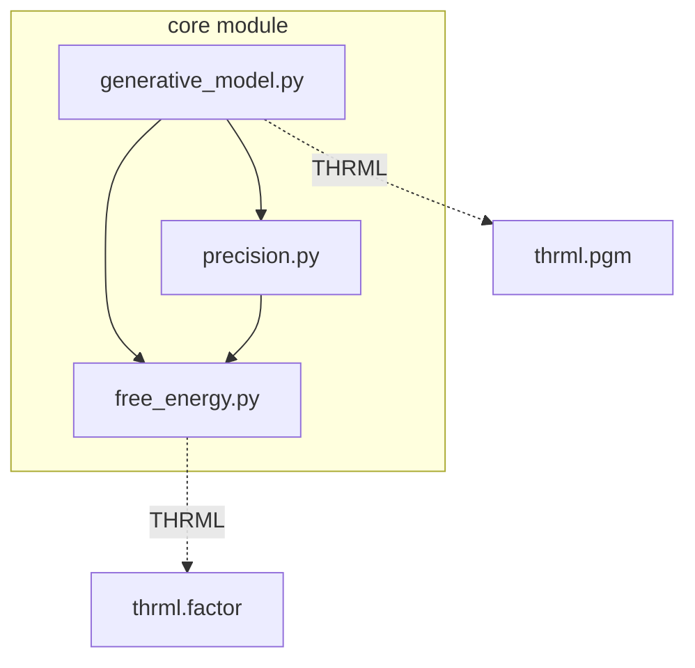

# Core Module Documentation

## Overview

The `core` module provides the foundational mathematical components for active inference, implementing the Free Energy Principle and belief-based decision making.

## Module Structure



## Components

### Generative Model (`generative_model.py`)

#### `GenerativeModel`

**Purpose**: Represents agent's beliefs about world dynamics (POMDP structure)

**Mathematical Foundation**:
- Encodes joint distribution: \( P(o, s, s' | a) = P(o|s) P(s'|s,a) P(s) \)
- POMDP components: States, Observations, Actions, Transitions

**Attributes**:
```python
n_states: int              # Number of hidden states
n_observations: int        # Number of observations
n_actions: int            # Number of actions
A: Array[n_obs, n_states] # Observation likelihood P(o|s)
B: Array[n_states, n_states, n_actions]  # Transitions P(s'|s,a)
C: Array[n_obs]           # Preferred observations (goals)
D: Array[n_states]        # Initial state prior P(s_0)
```

**Methods**:

##### `get_observation_likelihood(observation: int)`
**Returns**: Likelihood vector P(o|s) for all states
**Usage**: Inference and perception
```python
likelihood = model.get_observation_likelihood(obs)  # [n_states]
```

##### `get_state_transition(action: int)`
**Returns**: Transition matrix P(s'|s,a)
**Usage**: Prediction and planning
```python
transition = model.get_state_transition(action)  # [n_states, n_states]
```

##### `predict_observation(state_belief: Array)`
**Returns**: Expected observation P(o) = Σ_s P(o|s) P(s)
**Usage**: Predictive processing
```python
predicted_obs = model.predict_observation(belief)  # [n_obs]
```

##### `predict_next_state(state_belief: Array, action: int)`
**Returns**: Predicted next state P(s') = Σ_s P(s'|s,a) P(s)
**Usage**: Internal simulation
```python
next_belief = model.predict_next_state(belief, action)  # [n_states]
```

**Example**:
```python
from active_inference.core import GenerativeModel
import jax.numpy as jnp

# Create model
model = GenerativeModel(
    n_states=4,
    n_observations=2,
    n_actions=2,
)

# Access components
print(f"A matrix shape: {model.A.shape}")  # (2, 4)
print(f"B tensor shape: {model.B.shape}")  # (4, 4, 2)
```

**See**: [API Reference](api.md#generativemodel) | [Custom Models](custom_models.md)

---

#### `HierarchicalGenerativeModel`

**Purpose**: Multi-level generative models for hierarchical inference

**Structure**:
```python
levels: List[GenerativeModel]  # Hierarchy of models
connections: Array             # Inter-level connections
```

**Usage**:
```python
hierarchical_model = HierarchicalGenerativeModel(
    levels=[lower_model, higher_model],
    connections=connection_matrix
)
```

**See**: [Hierarchical Models](hierarchical_models.md)

---

#### Helper Functions

##### `normalize_distribution(array: Array, axis: int = -1)`
**Purpose**: Normalize to probability distribution (sum to 1)
**Usage**: Ensure valid probabilities
```python
normalized = normalize_distribution(unnormalized_probs)
assert jnp.allclose(normalized.sum(), 1.0)
```

##### `softmax_stable(logits: Array, axis: int = -1)`
**Purpose**: Numerically stable softmax
**Formula**: \( \text{softmax}(x_i) = \frac{e^{x_i - \max(x)}}{\sum_j e^{x_j - \max(x)}} \)
**Usage**: Convert logits to probabilities
```python
probs = softmax_stable(logits)
```

---

### Free Energy (`free_energy.py`)

#### `variational_free_energy(observation, state_belief, model)`

**Purpose**: Compute variational free energy for inference quality

**Mathematical Definition**:
\[
F = E_Q[\log Q(s) - \log P(o, s)] = -E_Q[\log P(o|s)] + D_{KL}[Q(s) || P(s)]
\]

**Decomposition**:
- **Accuracy**: \( -E_Q[\log P(o|s)] \) - How well beliefs explain observations
- **Complexity**: \( D_{KL}[Q(s) || P(s)] \) - Distance from prior

**Parameters**:
- `observation: int` - Observed index
- `state_belief: Array[n_states]` - Current belief Q(s)
- `model: GenerativeModel` - World model

**Returns**:
- `free_energy: float` - VFE value (lower = better)

**Usage**:
```python
from active_inference.core import variational_free_energy

fe = variational_free_energy(
    observation=obs_idx,
    state_belief=belief,
    model=model
)
print(f"Free Energy: {fe:.3f}")  # Lower is better
```

**Interpretation**:
- Low FE → Beliefs explain observations well
- High FE → Surprising observation / poor beliefs
- Minimizing FE → Bayesian inference

**See**: [Theory](theory.md#variational-free-energy) | [Inference Methods](inference_methods.md)

---

#### `expected_free_energy(state_belief, action, model)`

**Purpose**: Compute expected free energy for action selection

**Mathematical Definition**:
\[
G(\pi) = E_{Q(o,s'|\pi)}[\log Q(s'|\pi) - \log P(o, s')]
\]

**Decomposition**:
- **Pragmatic value**: \( -E[\log P(o)] \) - Goal achievement
- **Epistemic value**: \( H[P(o|s')] - H[P(o)] \) - Information gain

**Parameters**:
- `state_belief: Array[n_states]` - Current belief
- `action: int` - Action to evaluate
- `model: GenerativeModel` - World model

**Returns**:
- `efe: float` - Expected free energy (lower = better action)

**Usage**:
```python
from active_inference.core import expected_free_energy

# Evaluate all actions
efes = []
for action in range(model.n_actions):
    efe = expected_free_energy(belief, action, model)
    efes.append(efe)

best_action = jnp.argmin(jnp.array(efes))
```

**Interpretation**:
- **Low EFE**: Achieves goals (pragmatic) + reduces uncertainty (epistemic)
- **High EFE**: Fails goals or uninformative
- Action selection: Choose action minimizing EFE

**Balance**:
- C vector strength → More goal-seeking (exploitation)
- Uniform C → More info-seeking (exploration)

**See**: [Theory](theory.md#expected-free-energy) | [Planning](planning_algorithms.md)

---

#### `batch_expected_free_energy(state_belief, model)`

**Purpose**: Compute EFE for all actions at once (not exported, import directly)

**Returns**:
- `efes: Array[n_actions]` - EFE for each action

**Usage**:
```python
from active_inference.core.free_energy import batch_expected_free_energy

efes = batch_expected_free_energy(belief, model)  # [n_actions]
best_action = jnp.argmin(efes)
```

**Advantage**: More efficient than looping

---

### Precision (`precision.py`)

#### `Precision`

**Purpose**: Controls influence of different information sources

**Attributes**:
```python
sensory_precision: float = 1.0    # Trust in observations
state_precision: float = 1.0      # Trust in state predictions
action_precision: float = 1.0     # Decisiveness in action selection
```

**Mathematical Role**:
- Weights prediction errors: \( \epsilon = \gamma \cdot (o - \hat{o}) \)
- Controls action stochasticity: \( P(a) \propto \exp(-\beta \cdot G(a)) \)

**Usage**:
```python
from active_inference.core import Precision

# Conservative agent (low precision)
conservative = Precision(
    sensory_precision=0.5,
    action_precision=0.5  # More exploratory
)

# Confident agent (high precision)
confident = Precision(
    sensory_precision=2.0,
    action_precision=5.0  # More deterministic
)
```

**Effects**:
- **High sensory precision**: Trust observations more, faster belief updates
- **Low sensory precision**: Rely more on prior, slower updates
- **High action precision**: More deterministic actions (exploitation)
- **Low action precision**: More stochastic actions (exploration)

**See**: [Precision Control](precision_control.md) | [Example 03](../examples/03_precision_control.py)

---

#### `PrecisionWeighting`

**Purpose**: Utility functions for precision-weighted operations

**Methods**:

##### `apply_sensory_precision(prediction_error, precision)`
**Returns**: Weighted prediction error
```python
weighted_error = PrecisionWeighting.apply_sensory_precision(error, precision)
```

##### `apply_action_precision(efes, precision)`
**Returns**: Precision-weighted action distribution
```python
action_probs = PrecisionWeighting.apply_action_precision(efes, precision)
```

---

#### `Message`

**Purpose**: Message passing for hierarchical inference

**Attributes**:
```python
content: Array        # Message content
source: str          # Source level/node
target: str          # Target level/node
message_type: MessageType  # BOTTOM_UP, TOP_DOWN, LATERAL
```

**Usage**:
```python
from active_inference.core import Message, MessageType

bottom_up_msg = Message(
    content=prediction_error,
    source="level_1",
    target="level_2",
    message_type=MessageType.BOTTOM_UP
)
```

**See**: [Hierarchical Inference](hierarchical_inference.md)

---

#### `MessageType` (Enum)

**Values**:
- `BOTTOM_UP`: Prediction errors from lower levels
- `TOP_DOWN`: Predictions from higher levels
- `LATERAL`: Context from same level

---

## Integration with THRML

### Current Status
- Uses JAX operations directly
- Compatible with THRML through JAX

### Integration Opportunities

#### 1. CategoricalNode for States
```python
from thrml import CategoricalNode

state_node = CategoricalNode(
    n_categories=model.n_states,
    name="hidden_state"
)
```

#### 2. Factors for Generative Model
```python
from thrml import AbstractFactor

class ObservationLikelihoodFactor(AbstractFactor):
    def __init__(self, A_matrix, observation):
        self.A = A_matrix
        self.obs = observation

    def energy(self, state):
        return -jnp.log(self.A[self.obs, state['s']] + 1e-10)
```

#### 3. Sampling for Inference
```python
from thrml import sample_states, BlockGibbsSpec

# Use THRML sampling instead of variational inference
samples = sample_states(key, spec, factors, n_samples=1000)
posterior = aggregate_samples(samples)
```

**See**: [THRML Integration Guide](thrml_integration.md)

---

## Usage Patterns

### Pattern 1: Create and Use Model
```python
from active_inference.core import GenerativeModel
import jax.numpy as jnp

# Create model
model = GenerativeModel(n_states=4, n_observations=2, n_actions=2)

# Use in inference
likelihood = model.get_observation_likelihood(obs)
prior = model.D
posterior = normalize_distribution(likelihood * prior)
```

### Pattern 2: Custom Model Specification
```python
# Custom A matrix (deterministic observations)
A = jnp.eye(4, 4)  # Each state → unique observation

# Custom B tensor (deterministic dynamics)
B = jnp.zeros((4, 4, 2))
B = B.at[1, 0, 0].set(1.0)  # Action 0: state 0 → 1
B = B.at[0, 1, 1].set(1.0)  # Action 1: state 1 → 0
# ... etc

# Custom preferences (goal at state 3)
C = jnp.array([0., 0., 0., 10.])

model = GenerativeModel(
    n_states=4, n_observations=4, n_actions=2,
    A=A, B=B, C=C
)
```

### Pattern 3: Precision-Weighted Inference
```python
from active_inference.core import Precision, variational_free_energy

precision = Precision(sensory_precision=2.0)

# Weight observation likelihood
weighted_likelihood = likelihood ** precision.sensory_precision
posterior = normalize_distribution(weighted_likelihood * prior)

# Compute weighted free energy
fe = variational_free_energy(obs, posterior, model)
```

---

## Cross-References

- [Architecture](architecture.md#core-modules) - System overview
- [API Reference](api.md#core-components) - Complete API
- [Theory](theory.md) - Mathematical background
- [Inference Module](module_inference.md) - Using core for inference
- [Agent Module](module_agents.md) - Using core for agents
- [THRML Integration](thrml_integration.md) - THRML compatibility

---

## Examples

- [Example 01: Basic Inference](../examples/01_basic_inference.py)
- [Example 03: Precision Control](../examples/03_precision_control.py)
- [Example 10: Active Inference Fundamentals](../examples/10_active_inference_fundamentals.py)

---

## Source Code

**Location**: `src/active_inference/core/`
- `generative_model.py` - [View Source](../src/active_inference/core/generative_model.py)
- `free_energy.py` - [View Source](../src/active_inference/core/free_energy.py)
- `precision.py` - [View Source](../src/active_inference/core/precision.py)
