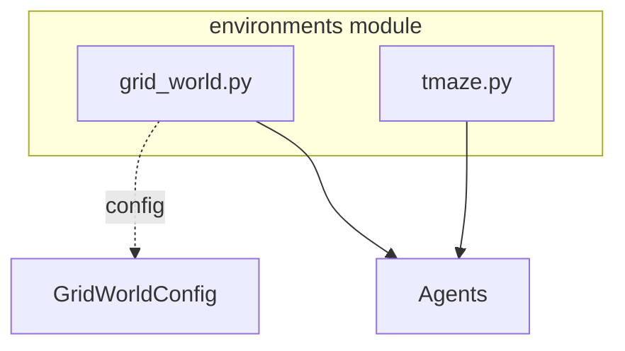

# Environment Module Documentation

## Overview

The `environments` module provides test environments for evaluating active inference agents, including spatial navigation and decision-making tasks.

## Module Structure



## Components

### Grid World (`grid_world.py`)

2D grid navigation environment with configurable size, obstacles, and goals.

#### `GridWorldConfig`

**Purpose**: Configuration for grid world environment

**Attributes**:
```python
size: int = 5                          # Grid size (size × size)
goal_location: Tuple[int, int] = (4,4) # Goal position
start_location: Tuple[int, int] = (0,0) # Start position
obstacles: List[Tuple[int, int]] = []  # Obstacle positions
n_observations: int = 25               # Number of observations
observation_noise: float = 0.0         # Observation noise level
stochastic_transitions: float = 0.0    # Transition stochasticity
rewards: Dict = None                   # Custom reward structure
```

**Example**:
```python
from active_inference.environments import GridWorldConfig

config = GridWorldConfig(
    size=7,
    goal_location=(6, 6),
    start_location=(0, 0),
    obstacles=[(3, 3), (3, 4), (4, 3)],  # L-shaped obstacle
    observation_noise=0.1,
    stochastic_transitions=0.1
)
```

---

#### `GridWorld`

**Purpose**: 2D grid navigation environment

**State Space**:
- Position: (x, y) coordinates
- Size: `size × size` discrete positions

**Action Space**:
```python
actions = {
    0: "up"     → (x, y-1)
    1: "right"  → (x+1, y)
    2: "down"   → (x, y+1)
    3: "left"   → (x-1, y)
}
```

**Observation Space**:
- Noisy position observations
- Optional aliasing (fewer observations than states)

**Dynamics**:
```
s' = s + action_direction  (if valid)
s' = s                      (if blocked/boundary)
```

**Visualization**:
```
. . . . G    (. = empty, A = agent,
. X X . .     X = obstacle, G = goal)
. X . . .
. . . . .
A . . . .
```

**Initialization**:
```python
from active_inference.environments import GridWorld, GridWorldConfig

config = GridWorldConfig(size=5, goal_location=(4, 4))
env = GridWorld(config=config)
```

---

#### `GridWorld.reset(key)`

**Purpose**: Reset environment to initial state

**Parameters**:
- `key: PRNGKey` - JAX random key

**Returns**:
- `observation: int` - Initial observation

**Example**:
```python
import jax

key = jax.random.key(42)
obs = env.reset(key)
print(f"Initial observation: {obs}")
```

---

#### `GridWorld.step(key, action)`

**Purpose**: Execute action and transition to next state

**Parameters**:
- `key: PRNGKey` - JAX random key
- `action: int` - Action index (0-3)

**Returns**:
- `observation: int` - New observation
- `reward: float` - Reward received
- `done: bool` - Episode termination flag

**Reward Structure**:
```python
reward = {
    goal_reached: +1.0,
    step_cost: -0.01,
    obstacle_hit: -0.1
}
```

**Example**:
```python
import jax

key = jax.random.key(42)
obs = env.reset(key)

for step in range(100):
    action = agent.select_action(obs)

    key, subkey = jax.random.split(key)
    obs, reward, done = env.step(subkey, action)

    print(f"Step {step}: obs={obs}, reward={reward:.3f}")

    if done:
        print("Goal reached!")
        break
```

---

#### `GridWorld.get_observation(state)`

**Purpose**: Get observation from state (for agent perception)

**Parameters**:
- `state: Array` - Current state

**Returns**:
- `observation: int` - Observation index

---

#### `GridWorld.render()`

**Purpose**: Render current environment state

**Returns**: ASCII visualization string

**Example**:
```python
print(env.render())
# Output:
# . . . . G
# . X X . .
# . X . . .
# . A . . .
# . . . . .
```

---

#### `GridWorld.get_state_from_position(x, y)`

**Purpose**: Convert (x, y) position to state index

**Returns**: State index

---

#### `GridWorld.get_position_from_state(state)`

**Purpose**: Convert state index to (x, y) position

**Returns**: Tuple (x, y)

---

### T-Maze (`tmaze.py`)

Decision-making task requiring working memory and planning.

#### `TMaze`

**Purpose**: T-maze environment for decision tasks

**Task Structure**:
```
         L   R
         |   |
         |   |
         +---+
           |
           |
           S
           ↑
         (cue)
```

**Phases**:
1. **Cue Phase**: Agent sees cue (left or right)
2. **Approach Phase**: Agent navigates to center
3. **Choice Phase**: Agent chooses left or right arm
4. **Outcome Phase**: Reward if correct choice

**State Space**:
```python
positions = {
    0: "start",
    1: "approach_1",
    2: "approach_2",
    3: "center",
    4: "left_arm",
    5: "right_arm"
}

# Plus hidden cue state
```

**Action Space**:
```python
actions = {
    0: "forward",
    1: "left",
    2: "right"
}
```

**Observation Space**:
```python
observations = {
    0: "cue_left",     # Cue: go left
    1: "cue_right",    # Cue: go right
    2: "at_start",
    3: "at_center",
    4: "at_left_arm",
    5: "at_right_arm",
    6: "reward",
    7: "no_reward"
}
```

**Initialization**:
```python
from active_inference.environments import TMaze

env = TMaze(
    reward_side=0,  # 0=left, 1=right
    cue_reliability=0.9
)
```

---

#### `TMaze.reset(key)`

**Purpose**: Reset to start and present cue

**Parameters**:
- `key: PRNGKey` - JAX random key

**Returns**:
- `observation: int` - Cue observation
- `cue_presented: int` - Which cue was shown

**Example**:
```python
import jax

key = jax.random.key(42)
obs, cue = env.reset(key)
print(f"Cue: {'left' if cue == 0 else 'right'}")
```

---

#### `TMaze.step(action)`

**Purpose**: Execute action in T-maze

**Parameters**:
- `action: int` - Action index

**Returns**:
- `observation: int` - New observation
- `reward: float` - Reward (1.0 if correct, 0.0 if wrong, -0.01 for step)
- `done: bool` - Episode done flag

**Reward Structure**:
```python
if reached_goal_arm and cue_matched:
    reward = 1.0
    done = True
elif reached_wrong_arm:
    reward = 0.0
    done = True
else:
    reward = -0.01  # Step cost
    done = False
```

**Example**:
```python
# Full episode
obs, cue = env.reset(key)

# Remember cue
remembered_cue = cue

# Navigate to center
while position != "center":
    action = 0  # forward
    obs, reward, done = env.step(action)

# Choose based on cue
if remembered_cue == 0:
    action = 1  # left
else:
    action = 2  # right

obs, reward, done = env.step(action)
print(f"Reward: {reward}")
```

---

#### `TMaze.render()`

**Purpose**: Render T-maze state

**Returns**: ASCII visualization

---

## Environment API

### Standard Interface

All environments implement:

```python
class Environment:
    def reset(self, key: PRNGKey) -> Observation:
        """Reset environment."""
        pass

    def step(self, key: PRNGKey, action: int) -> Tuple[Observation, Reward, Done]:
        """Execute action."""
        pass

    def render(self) -> str:
        """Visualize state."""
        pass

    def get_observation(self, state) -> Observation:
        """Get observation from state."""
        pass
```

---

## Usage Patterns

### Pattern 1: Basic Environment Loop

```python
from active_inference.environments import GridWorld
import jax

env = GridWorld(size=5)
key = jax.random.key(42)

obs = env.reset(key)

for step in range(100):
    action = select_action(obs)  # Your policy

    key, subkey = jax.random.split(key)
    obs, reward, done = env.step(subkey, action)

    if done:
        break
```

### Pattern 2: Environment with Agent

```python
from active_inference.environments import GridWorld
from active_inference.agents import ActiveInferenceAgent
from active_inference.models import build_grid_world_model

# Create environment
config = GridWorldConfig(size=5, goal_location=(4, 4))
env = GridWorld(config=config)

# Create matching model and agent
model = build_grid_world_model(config)
agent = ActiveInferenceAgent(model=model)

# Run episode
agent_state = agent.reset()
obs = env.reset(key)
total_reward = 0

for step in range(100):
    # Agent perceives and acts
    action, agent_state, fe = agent.step(key, obs, agent_state)

    # Environment responds
    key, subkey = jax.random.split(key)
    obs, reward, done = env.step(subkey, action)

    total_reward += reward

    if done:
        break

print(f"Total reward: {total_reward}")
```

### Pattern 3: Batch Environments

```python
import jax

def run_episode(key):
    env = GridWorld(size=5)
    obs = env.reset(key)
    total_reward = 0

    for _ in range(100):
        action = random_policy(obs)
        key, subkey = jax.random.split(key)
        obs, reward, done = env.step(subkey, action)
        total_reward += reward
        if done:
            break

    return total_reward

# Run multiple episodes in parallel
keys = jax.random.split(jax.random.key(42), 100)
rewards = jax.vmap(run_episode)(keys)
print(f"Mean reward: {rewards.mean():.2f} ± {rewards.std():.2f}")
```

---

## Environment Visualization

### Plotting Trajectories

```python
from active_inference.visualization import plot_trajectory, animate_agent_behavior

# Collect trajectory
trajectory = []
obs = env.reset(key)

for step in range(50):
    trajectory.append(env.state)
    action, agent_state, _ = agent.step(key, obs, agent_state)
    obs, reward, done = env.step(key, action)
    if done:
        break

# Plot
fig, ax = plot_trajectory(
    trajectory,
    env=env,
    save_path="trajectory.png"
)

# Animate
animate_agent_behavior(
    trajectory,
    env=env,
    save_path="trajectory.gif"
)
```

**See**: [Visualization Module](module_visualization.md)

---

## Custom Environments

### Creating Custom Environment

```python
import equinox as eqx
import jax.numpy as jnp

class CustomEnvironment(eqx.Module):
    """Custom environment following standard interface."""

    state_dim: int
    action_dim: int
    obs_dim: int

    def reset(self, key):
        """Initialize environment state."""
        return jnp.zeros(self.obs_dim, dtype=int)

    def step(self, key, action):
        """Execute action and return (obs, reward, done)."""
        # Your dynamics here
        next_obs = ...
        reward = ...
        done = ...
        return next_obs, reward, done

    def render(self):
        """Return string visualization."""
        return "Custom environment state"
```

**See**: [Custom Environments Guide](custom_environments.md)

---

## Environment Testing

### Validation

```python
from active_inference.utils import validate_environment

# Check environment validity
validate_environment(env)
```

**Checks**:
- ✅ Reset returns valid observation
- ✅ Step returns (obs, reward, done)
- ✅ Actions within valid range accepted
- ✅ Observations within valid range
- ✅ Episode terminates correctly
- ✅ Render produces output

---

## Integration with THRML

### Environment as Factor

```python
from thrml import AbstractFactor

class EnvironmentFactor(AbstractFactor):
    """Convert environment to THRML factor."""

    def __init__(self, env, observation):
        self.env = env
        self.obs = observation

    def energy(self, state):
        """E = -log P(o|s) from environment."""
        expected_obs = self.env.get_observation(state['position'])

        if expected_obs == self.obs:
            return 0.0  # High probability
        else:
            return 10.0  # Low probability

    def involved_blocks(self):
        return ['position']
```

---

## Cross-References

- [Architecture](architecture.md#environment-modules) - System overview
- [Model Module](module_models.md) - Corresponding generative models
- [Agent Module](module_agents.md) - Agents using environments
- [Visualization Module](module_visualization.md) - Environment plotting
- [API Reference](api.md#environments) - Complete API

---

## Examples

- [Example 02: Grid World Agent](../examples/02_grid_world_agent.py)
- [Example 05: POMDP Example](../examples/05_pomdp_example.py)

---

## Source Code

**Location**: `src/active_inference/environments/`
- `grid_world.py` - [View Source](../src/active_inference/environments/grid_world.py)
- `tmaze.py` - [View Source](../src/active_inference/environments/tmaze.py)
