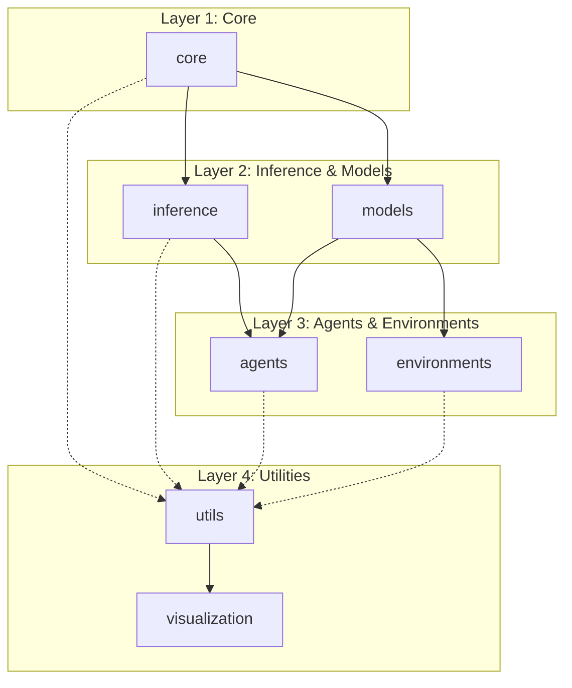

# Module Reference Index

Complete reference for all active_inference modules with detailed documentation links.

## Navigation

```mermaid
graph TB
    INDEX[Module Index]

    INDEX --> CORE[Core Modules]
    INDEX --> INF[Inference Modules]
    INDEX --> AGT[Agent Modules]
    INDEX --> MOD[Model Modules]
    INDEX --> ENV[Environment Modules]
    INDEX --> UTL[Utility Modules]
    INDEX --> VIZ[Visualization Modules]

    CORE --> GM[GenerativeModel]
    CORE --> FE[Free Energy]
    CORE --> PR[Precision]

    INF --> SI[State Inference]
    INF --> TI[THRML Inference]

    AGT --> BA[Base Agent]
    AGT --> PL[Planning]

    MOD --> DM[Discrete MDP]

    ENV --> GW[GridWorld]
    ENV --> TM[TMaze]

    UTL --> ME[Metrics]
    UTL --> SA[Statistical Analysis]
    UTL --> VA[Validation]
    UTL --> RT[Resource Tracking]
    UTL --> VI[Visualization Utils]

    VIZ --> AI[Active Inference Plots]
    VIZ --> EP[Environment Plots]
    VIZ --> SP[Statistical Plots]
    VIZ --> CP[Comparison Plots]
    VIZ --> NP[Network Plots]
    VIZ --> TP[THRML Plots]
    VIZ --> AN[Animation]
```

## Core Modules

### [`active_inference.core`](module_core.md)

Fundamental components for active inference.

| Component | Description | Documentation |
|-----------|-------------|---------------|
| `generative_model.py` | POMDP generative models | [Details](module_core.md#generative-model) |
| `free_energy.py` | VFE and EFE calculations | [Details](module_core.md#free-energy) |
| `precision.py` | Precision weighting | [Details](module_core.md#precision) |

**Key Classes**:
- `GenerativeModel` - Core belief model
- `HierarchicalGenerativeModel` - Multi-level models
- `Precision` - Precision parameters
- `Message` - Message passing infrastructure

**See Also**: [Architecture](architecture.md#core-modules) | [API](api.md#core-components)

## Inference Modules

### [`active_inference.inference`](module_inference.md)

State inference and belief updating.

| Component | Description | Documentation |
|-----------|-------------|---------------|
| `state_inference.py` | Variational inference | [Details](module_inference.md#state-inference) |
| `thrml_inference.py` | THRML sampling inference | [Details](module_inference.md#thrml-inference) |

**Key Classes**:
- `ThrmlInferenceEngine` - Sampling-based inference

**Key Functions**:
- `infer_states()` - Variational belief updating
- `variational_message_passing()` - Sequential inference

**See Also**: [Inference Methods](inference_methods.md) | [THRML Integration](thrml_integration.md)

## Agent Modules

### [`active_inference.agents`](module_agents.md)

Complete perception-action agents.

| Component | Description | Documentation |
|-----------|-------------|---------------|
| `base_agent.py` | Core agent implementation | [Details](module_agents.md#base-agent) |
| `planning.py` | Planning algorithms | [Details](module_agents.md#planning) |

**Key Classes**:
- `ActiveInferenceAgent` - Main agent
- `AgentState` - Internal state tracking

**Key Functions**:
- `plan_action()` - Single-step planning
- `plan_with_tree_search()` - Multi-step planning
- `evaluate_policy()` - Policy evaluation

**See Also**: [Agent Usage](agent_usage.md) | [Planning Algorithms](planning_algorithms.md)

## Model Modules

### [`active_inference.models`](module_models.md)

Pre-built generative models for common tasks.

| Component | Description | Documentation |
|-----------|-------------|---------------|
| `discrete_mdp.py` | MDP model builders | [Details](module_models.md#discrete-mdp) |

**Key Functions**:
- `build_grid_world_model()` - Grid navigation
- `build_tmaze_model()` - Decision task
- `build_hierarchical_model()` - Multi-level models

**See Also**: [Custom Models](custom_models.md) | [Model Building](model_building.md)

## Environment Modules

### [`active_inference.environments`](module_environments.md)

Test environments for evaluation.

| Component | Description | Documentation |
|-----------|-------------|---------------|
| `grid_world.py` | 2D navigation | [Details](module_environments.md#gridworld) |
| `tmaze.py` | Decision task | [Details](module_environments.md#tmaze) |

**Key Classes**:
- `GridWorld` - Grid navigation environment
- `GridWorldConfig` - Grid configuration
- `TMaze` - T-maze environment

**See Also**: [Custom Environments](custom_environments.md) | [Environment API](environment_api.md)

## Utility Modules

### [`active_inference.utils`](module_utils.md)

Analysis, validation, and utilities.

| Component | Description | Documentation |
|-----------|-------------|---------------|
| `metrics.py` | Performance metrics | [Details](module_utils.md#metrics) |
| `statistical_analysis.py` | Statistical methods | [Details](module_utils.md#statistical-analysis) |
| `validation.py` | Data validation | [Details](module_utils.md#validation) |
| `resource_tracking.py` | Resource monitoring | [Details](module_utils.md#resource-tracking) |
| `visualization.py` | Basic plotting | [Details](module_utils.md#visualization) |

**Key Classes**:
- `DataValidator` - Validation framework
- `ResourceTracker` - Resource monitoring

**Key Functions**:
- `linear_regression()` - Regression analysis
- `pearson_correlation()` - Correlation analysis
- `calculate_kl_divergence()` - KL divergence

**See Also**: [Analysis & Validation](analysis_validation.md)

## Visualization Modules

### [`active_inference.visualization`](module_visualization.md)

Advanced plotting and animation.

| Component | Description | Documentation |
|-----------|-------------|---------------|
| `core.py` | Plot infrastructure | [Details](module_visualization.md#core) |
| `active_inference_plots.py` | AI-specific plots | [Details](module_visualization.md#active-inference-plots) |
| `environment_plots.py` | Environment visualization | [Details](module_visualization.md#environment-plots) |
| `statistical_plots.py` | Statistical plots | [Details](module_visualization.md#statistical-plots) |
| `comparison_plots.py` | Comparative analysis | [Details](module_visualization.md#comparison-plots) |
| `network_plots.py` | Network visualization | [Details](module_visualization.md#network-plots) |
| `thrml_plots.py` | THRML visualizations | [Details](module_visualization.md#thrml-plots) |
| `animation.py` | Animated plots | [Details](module_visualization.md#animation) |

**See Also**: [Visualization Guide](visualization_guide.md)

## Quick Reference

### By Task

| Task | Module | Function/Class |
|------|--------|----------------|
| Create model | `core` | `GenerativeModel()` |
| Infer states | `inference` | `infer_states()` |
| Sample states | `inference` | `ThrmlInferenceEngine` |
| Create agent | `agents` | `ActiveInferenceAgent()` |
| Plan actions | `agents` | `plan_action()` |
| Build env | `environments` | `GridWorld()` |
| Validate data | `utils` | `DataValidator()` |
| Track resources | `utils` | `ResourceTracker()` |
| Plot beliefs | `visualization` | `plot_belief_trajectory()` |
| Animate | `visualization` | `animate_agent_behavior()` |

### By Use Case

| Use Case | Modules | Documentation |
|----------|---------|---------------|
| Basic inference | `core`, `inference` | [Getting Started](getting_started.md) |
| Agent navigation | `agents`, `environments` | [Agent Usage](agent_usage.md) |
| THRML sampling | `inference`, `thrml` | [THRML Integration](thrml_integration.md) |
| Statistical analysis | `utils` | [Analysis Guide](analysis_validation.md) |
| Custom models | `core`, `models` | [Custom Models](custom_models.md) |
| Visualization | `visualization` | [Visualization Guide](visualization_guide.md) |

## Module Dependencies

## External Dependencies

### THRML Integration

| Active Inference Module | THRML Module | Documentation |
|------------------------|--------------|---------------|
| `inference.thrml_inference` | `block_sampling` | [THRML Sampling](thrml_sampling.md) |
| `inference.thrml_inference` | `block_management` | [THRML Blocks](thrml_blocks.md) |
| `inference.thrml_inference` | `factor` | [THRML Factors](thrml_factors.md) |
| `utils` | `observers` | [THRML Observers](thrml_observers.md) |
| `core.generative_model` | `pgm` | [THRML PGM](../../docs/index.md) |

**See**: [THRML Integration Guide](thrml_integration.md) | [THRML Docs](../../docs/index.md)

### JAX Integration

All modules use JAX for:
- Array operations (`jax.numpy`)
- Automatic differentiation (`jax.grad`)
- JIT compilation (`jax.jit`)
- Vectorization (`jax.vmap`)
- Random number generation (`jax.random`)

**See**: [JAX Integration](jax_integration.md) | [JAX Docs](https://jax.readthedocs.io/)

## Cross-References

- [Architecture Overview](architecture.md) - System design
- [Getting Started](getting_started.md) - Quick start
- [API Reference](api.md) - Complete API
- [Theory](theory.md) - Theoretical background
- [Examples Index](../examples/INDEX.md) - Example code

## Module Documentation

Each module has detailed documentation:

1. **README.md** - Overview and structure
2. **agents.md** - Classes and functions
3. **.cursorrules** - Coding standards
4. **Inline docstrings** - Function/class documentation

**Access via**: Module directory (e.g., `src/active_inference/core/README.md`)
