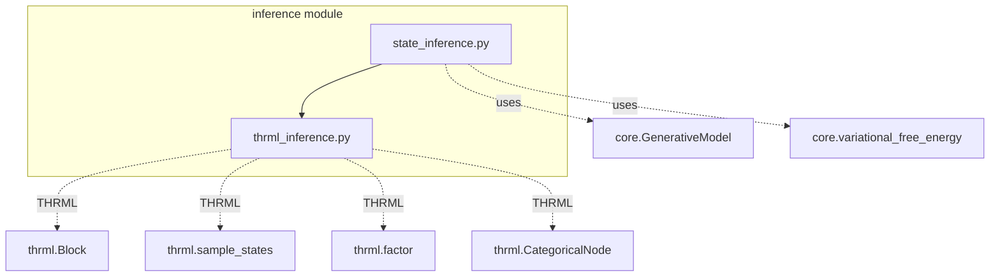
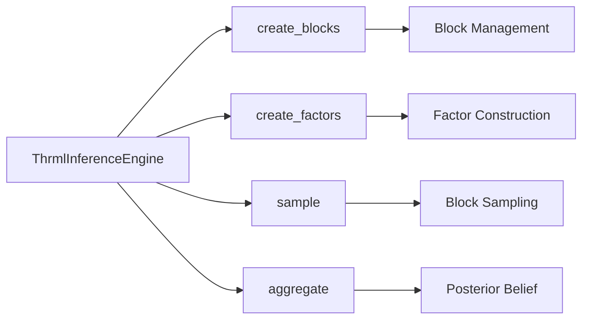
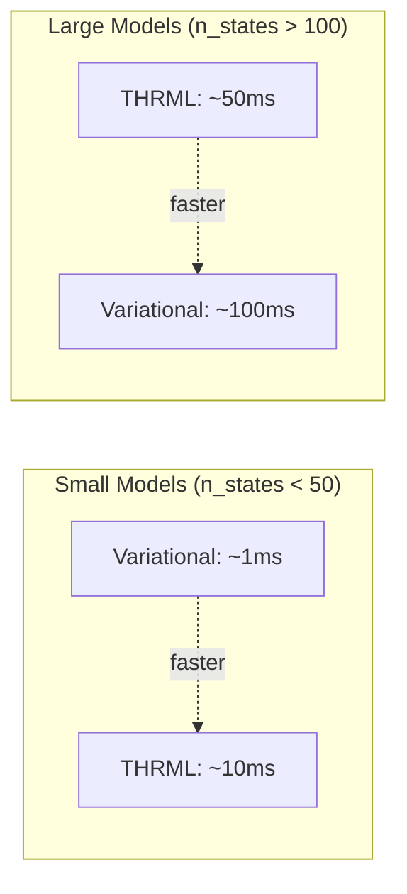

# Inference Module Documentation

## Overview

The `inference` module provides state inference engines for perception in active inference, including both traditional variational message passing and THRML-based sampling methods.

## Module Structure



## Components

### State Inference (`state_inference.py`)

Implements variational inference through iterative belief updating.

#### `infer_states(observation, prior_belief, model, n_iterations=16)`

**Purpose**: Perform state inference using fixed-point iteration

**Algorithm**:
```
For n iterations:
    1. Get likelihood: P(o|s) from model.A
    2. Compute posterior: Q(s) ∝ P(o|s) · Q_prior(s)
    3. Normalize to valid distribution
    4. Compute free energy
    5. Update belief
```

**Mathematical Foundation**:
\[
Q^{(t+1)}(s) \propto P(o|s) \cdot Q^{(t)}(s)
\]

**Parameters**:
- `observation: int` - Observed index
- `prior_belief: Array[n_states]` - Prior belief distribution
- `model: GenerativeModel` - World model
- `n_iterations: int = 16` - Number of update iterations

**Returns**:
- `posterior: Array[n_states]` - Posterior belief Q(s|o)
- `free_energy: float` - Final VFE value

**Example**:
```python
from active_inference.inference import infer_states
from active_inference.core import GenerativeModel

model = GenerativeModel(n_states=4, n_observations=2, n_actions=2)

# Perceive observation
observation = 1
prior = model.D  # Use model prior

posterior, fe = infer_states(
    observation=observation,
    prior_belief=prior,
    model=model,
    n_iterations=16
)

print(f"Posterior: {posterior}")
print(f"Free Energy: {fe:.3f}")
```

**Convergence**:
- Typically converges in 8-16 iterations
- Monitor free energy decrease
- Early stopping possible when change < threshold

**See**: [Getting Started](getting_started.md#basic-inference) | [Example 01](../examples/01_basic_inference.py)

---

#### `variational_message_passing(observations, initial_belief, model, n_iterations=16)`

**Purpose**: Perform sequential inference over observation sequence

**Algorithm**:
```
For each observation:
    1. Forward pass: Infer state from observation
    2. Backward pass: Smooth beliefs using future
    3. Return filtered beliefs
```

**Parameters**:
- `observations: Array[T]` - Sequence of observations
- `initial_belief: Array[n_states]` - Starting belief
- `model: GenerativeModel` - World model
- `n_iterations: int = 16` - Iterations per timestep

**Returns**:
- `beliefs: Array[T, n_states]` - Belief trajectory
- `free_energies: Array[T]` - FE at each timestep

**Example**:
```python
from active_inference.inference import variational_message_passing

observations = jnp.array([0, 1, 1, 0])
initial_belief = model.D

beliefs, fes = variational_message_passing(
    observations=observations,
    initial_belief=initial_belief,
    model=model
)

# Plot belief evolution
import matplotlib.pyplot as plt
plt.plot(beliefs)
plt.xlabel("Time")
plt.ylabel("Belief")
plt.legend([f"State {i}" for i in range(model.n_states)])
plt.show()
```

**Use Cases**:
- Offline inference on trajectories
- Smoothing noisy observations
- Analyzing belief dynamics

**See**: [Trajectory Analysis](trajectory_analysis.md)

---

#### `update_belief_batch(observations, prior_beliefs, model)`

**Purpose**: Batch inference over multiple observations (not exported)

**Parameters**:
- `observations: Array[batch_size]` - Batch of observations
- `prior_beliefs: Array[batch_size, n_states]` - Prior beliefs
- `model: GenerativeModel` - World model

**Returns**:
- `posteriors: Array[batch_size, n_states]` - Posterior beliefs
- `free_energies: Array[batch_size]` - FE values

**Usage** (import directly):
```python
from active_inference.inference.state_inference import update_belief_batch

# Batch processing
batch_obs = jnp.array([0, 1, 0, 1])
batch_priors = jnp.tile(model.D, (4, 1))

posteriors, fes = update_belief_batch(batch_obs, batch_priors, model)
```

**Advantage**: Vectorized processing for efficiency

---

### THRML Inference (`thrml_inference.py`)

Implements sampling-based inference using THRML's block Gibbs sampling.

#### `ThrmlInferenceEngine`

**Purpose**: Main class for THRML-based inference

**Architecture**:


**Attributes**:
```python
model: GenerativeModel           # World model
n_samples: int = 1000           # Number of samples
n_warmup: int = 100             # Warmup samples
precision: Precision = Precision()  # Precision parameters
```

**Initialization**:
```python
from active_inference.inference import ThrmlInferenceEngine
from active_inference.core import GenerativeModel, Precision

model = GenerativeModel(n_states=10, n_observations=8, n_actions=4)

engine = ThrmlInferenceEngine(
    model=model,
    n_samples=1000,
    n_warmup=100,
    precision=Precision(sensory_precision=2.0)
)
```

---

#### `ThrmlInferenceEngine.infer_with_sampling(key, observation)`

**Purpose**: Infer state distribution using THRML sampling

**Algorithm**:
```
1. Create state block (CategoricalNode)
2. Create observation factor (likelihood)
3. Create prior factor
4. Setup BlockGibbsSpec (states free, obs clamped)
5. Sample states using block Gibbs
6. Aggregate samples to posterior distribution
```

**Parameters**:
- `key: PRNGKey` - JAX random key
- `observation: int` - Observed index

**Returns**:
- `posterior: Array[n_states]` - Posterior distribution Q(s|o)

**Example**:
```python
import jax

key = jax.random.key(42)
observation = 3

posterior = engine.infer_with_sampling(key, observation)
print(f"Posterior (THRML): {posterior}")

# Compare with variational
from active_inference.inference import infer_states
posterior_var, fe = infer_states(observation, model.D, model)
print(f"Posterior (Variational): {posterior_var}")
```

**Performance**:
- Slower than variational (10-100x)
- More accurate for complex models
- Scales better to large state spaces

**See**: [THRML Integration](thrml_integration.md#pattern-1-state-inference)

---

#### `ThrmlInferenceEngine.sample_trajectory(key, actions, n_samples=100)`

**Purpose**: Sample state trajectories given action sequence

**Algorithm**:
```
1. Create temporal blocks for each timestep
2. Create transition factors between timesteps
3. Sample joint distribution over trajectory
4. Return sample trajectories
```

**Parameters**:
- `key: PRNGKey` - JAX random key
- `actions: Array[T]` - Action sequence
- `n_samples: int = 100` - Number of trajectories

**Returns**:
- `trajectories: Array[n_samples, T+1, n_states]` - State trajectories

**Example**:
```python
# Plan and sample trajectories
actions = jnp.array([0, 1, 0, 1])  # Action sequence
trajectories = engine.sample_trajectory(key, actions, n_samples=100)

# Analyze trajectory distribution
mean_trajectory = trajectories.mean(axis=0)
std_trajectory = trajectories.std(axis=0)

# Visualize
import matplotlib.pyplot as plt
for i in range(model.n_states):
    plt.plot(mean_trajectory[:, i], label=f"State {i}")
    plt.fill_between(
        range(len(mean_trajectory)),
        mean_trajectory[:, i] - std_trajectory[:, i],
        mean_trajectory[:, i] + std_trajectory[:, i],
        alpha=0.3
    )
plt.legend()
plt.show()
```

**Use Cases**:
- Uncertainty in planning
- Trajectory optimization
- Model evaluation

**See**: [Planning with Uncertainty](planning_algorithms.md#trajectory-sampling)

---

#### `ThrmlInferenceEngine.infer_with_precision(key, observation, sensory_precision)`

**Purpose**: Inference with custom sensory precision

**Parameters**:
- `key: PRNGKey` - Random key
- `observation: int` - Observed index
- `sensory_precision: float` - Precision weight

**Returns**:
- `posterior: Array[n_states]` - Posterior distribution

**Example**:
```python
# Compare different precisions
precisions = [0.5, 1.0, 2.0, 5.0]

for prec in precisions:
    posterior = engine.infer_with_precision(key, obs, prec)
    print(f"Precision {prec}: {posterior}")

# High precision → sharper posterior (more confident)
# Low precision → flatter posterior (more uncertain)
```

**See**: [Precision Control](precision_control.md)

---

## Integration with THRML

### Block Structure for Inference

```python
from thrml import Block, CategoricalNode

# State block (free variable)
state_block = Block(
    nodes=[CategoricalNode(n_categories=model.n_states)],
    name="hidden_states"
)

# Observation block (clamped to observed value)
obs_block = Block(
    nodes=[CategoricalNode(n_categories=model.n_observations)],
    name="observations"
)
```

### Factor Construction

```python
from thrml import AbstractFactor
import jax.numpy as jnp

class ObservationLikelihoodFactor(AbstractFactor):
    """P(o|s) from model.A matrix."""

    def __init__(self, A_matrix, observation_idx):
        self.A = A_matrix
        self.obs = observation_idx

    def energy(self, state):
        """Energy = -log P(o|s)."""
        state_idx = state['hidden_states']
        likelihood = self.A[self.obs, state_idx]
        return -jnp.log(likelihood + 1e-10)

    def involved_blocks(self):
        return ['hidden_states']

class StatePriorFactor(AbstractFactor):
    """P(s) from model.D."""

    def __init__(self, D_prior):
        self.D = D_prior

    def energy(self, state):
        """Energy = -log P(s)."""
        state_idx = state['hidden_states']
        prior_prob = self.D[state_idx]
        return -jnp.log(prior_prob + 1e-10)

    def involved_blocks(self):
        return ['hidden_states']
```

### Sampling Specification

```python
from thrml import BlockGibbsSpec, sample_states

# Setup inference (states free, obs clamped)
spec = BlockGibbsSpec(
    free=[state_block],
    clamped=[]  # Observation handled by factor
)

# Create factors
obs_factor = ObservationLikelihoodFactor(model.A, observation)
prior_factor = StatePriorFactor(model.D)

# Sample
samples = sample_states(
    key,
    spec,
    factors=[obs_factor, prior_factor],
    n_samples=1000
)

# Aggregate to posterior
state_samples = samples['hidden_states']
counts = jnp.bincount(state_samples, length=model.n_states)
posterior = counts / counts.sum()
```

**See**: [THRML Integration Guide](thrml_integration.md)

---

## Comparison: Variational vs THRML

### Computational Cost



### Accuracy

| Model Complexity | Variational | THRML |
|-----------------|-------------|-------|
| Simple (few states, deterministic) | Exact | Accurate |
| Moderate (many states, noisy) | Good approximation | Very accurate |
| Complex (hierarchical, multi-modal) | May fail | Robust |

### When to Use Each

**Use Variational (`infer_states`) when**:
- Real-time control needed (< 10ms latency)
- Small state space (< 50 states)
- Simple observation models
- Unimodal posteriors

**Use THRML (`ThrmlInferenceEngine`) when**:
- Offline analysis (latency ok)
- Large state space (> 100 states)
- Complex/hierarchical models
- Multi-modal posteriors
- Need uncertainty quantification

**See**: [Performance Guide](performance.md)

---

## Usage Patterns

### Pattern 1: Basic Inference

```python
from active_inference.inference import infer_states
from active_inference.core import GenerativeModel

# Setup
model = GenerativeModel(n_states=4, n_observations=2, n_actions=2)
observation = 1

# Infer
posterior, fe = infer_states(observation, model.D, model)
```

### Pattern 2: Sequential Inference

```python
from active_inference.inference import infer_states

observations = [0, 1, 1, 0]
beliefs = []
current_belief = model.D

for obs in observations:
    posterior, fe = infer_states(obs, current_belief, model)
    beliefs.append(posterior)

    # Predict next state (if taking action)
    current_belief = model.predict_next_state(posterior, action=0)

beliefs = jnp.array(beliefs)
```

### Pattern 3: THRML Sampling

```python
from active_inference.inference import ThrmlInferenceEngine
import jax

# Setup engine
engine = ThrmlInferenceEngine(model, n_samples=1000)

# Infer
key = jax.random.key(42)
posterior = engine.infer_with_sampling(key, observation)
```

### Pattern 4: Batch Inference

```python
import jax

# Vectorize over observations
infer_fn = lambda obs: infer_states(obs, model.D, model)[0]
posteriors = jax.vmap(infer_fn)(observations)

# posteriors.shape = (n_obs, n_states)
```

---

## Cross-References

- [Architecture](architecture.md#inference-modules) - System overview
- [Core Module](module_core.md) - Generative models and free energy
- [Agent Module](module_agents.md) - Using inference in agents
- [THRML Integration](thrml_integration.md) - Detailed THRML usage
- [API Reference](api.md#inference) - Complete API
- [Theory](theory.md#perception-as-inference) - Theoretical background

---

## Examples

- [Example 01: Basic Inference](../examples/01_basic_inference.py)
- [Example 11: THRML Comprehensive](../examples/11_thrml_comprehensive.py)
- [Example 12: Statistical Validation](../examples/12_statistical_validation_demo.py)

---

## Source Code

**Location**: `src/active_inference/inference/`
- `state_inference.py` - [View Source](../src/active_inference/inference/state_inference.py)
- `thrml_inference.py` - [View Source](../src/active_inference/inference/thrml_inference.py)
