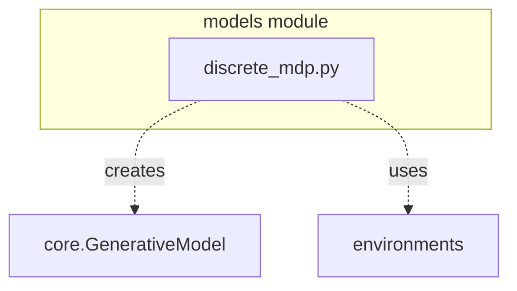
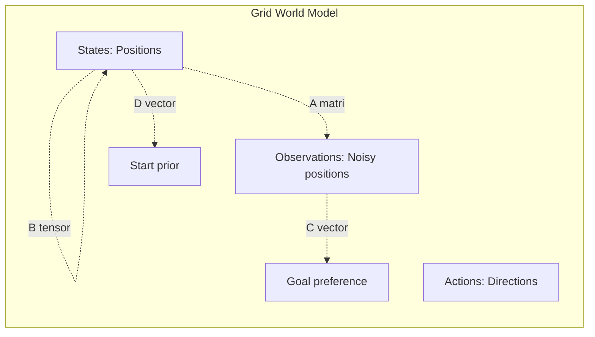
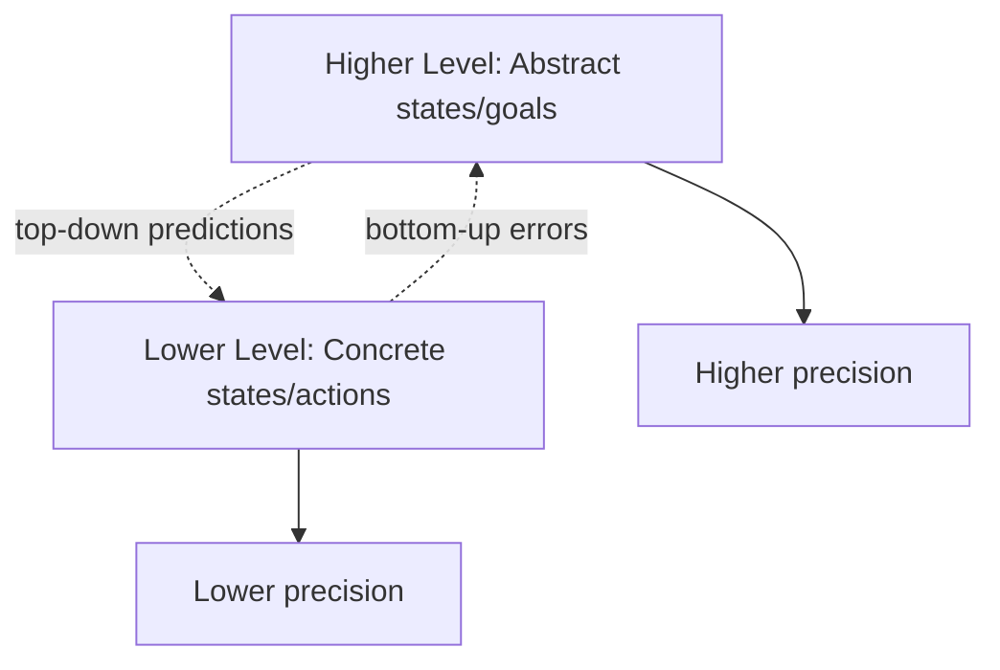

# Model Module Documentation

## Overview

The `models` module provides pre-built generative model constructors for common active inference tasks, including discrete MDPs, POMDPs, and hierarchical models.

## Module Structure



## Components

### Discrete MDP (`discrete_mdp.py`)

Pre-built model constructors for discrete state-space tasks.

#### `build_grid_world_model(config, goal_preference_strength=2.0)`

**Purpose**: Create generative model for grid world navigation

**Algorithm**:
```
1. Define state space: (x, y) positions
2. Define observations: Noisy position observations
3. Define transitions: 4 directional movements (up, down, left, right)
4. Define preferences: High value at goal location
```

**Parameters**:
- `config: GridWorldConfig` - Grid configuration (size, goal location, etc.)
- `goal_preference_strength: float = 2.0` - Strength of goal preference

**Returns**:
- `model: GenerativeModel` - Complete grid world model

**Model Structure**:
```python
# State space
n_states = size × size  # All grid positions

# Observation space
n_observations = size × size + noise_states

# Action space
n_actions = 4  # [up, right, down, left]

# A matrix: Observation likelihood
# - Identity mapping if no noise
# - Blurred if noisy observations

# B tensor: State transitions
# - Deterministic or stochastic movement
# - Walls block transitions
# - Out-of-bounds transitions loop back

# C vector: Preferences
# - High value at goal position
# - Zero elsewhere

# D vector: Prior
# - Uniform or peaked at start position
```

**Example**:
```python
from active_inference.models import build_grid_world_model
from active_inference.environments import GridWorldConfig

config = GridWorldConfig(
    size=5,
    goal_location=(4, 4),
    start_location=(0, 0),
    obstacles=[(2, 2)],
    n_observations=25
)

model = build_grid_world_model(
    config=config,
    goal_preference_strength=3.0
)

print(f"States: {model.n_states}")
print(f"Observations: {model.n_observations}")
print(f"Actions: {model.n_actions}")
```

**Visualization**:


**Use Cases**:
- Navigation tasks
- Spatial reasoning
- Goal-directed behavior

**See**: [Example 02](../examples/02_grid_world_agent.py) | [GridWorld Environment](module_environments.md#gridworld)

---

#### `build_tmaze_model(reward_side, prior_confidence=0.5)`

**Purpose**: Create generative model for T-maze decision task

**Task Description**:
- Agent starts at bottom of T
- Receives cue indicating reward side (left/right)
- Must navigate to center, then choose correct arm
- Tests working memory and decision making

**Parameters**:
- `reward_side: int` - Which side has reward (0=left, 1=right)
- `prior_confidence: float = 0.5` - Initial belief confidence

**Returns**:
- `model: GenerativeModel` - Complete T-maze model

**Model Structure**:
```python
# State space
states = [
    "start",           # 0: Starting position
    "center",          # 1: Center junction
    "left_arm",        # 2: Left arm
    "right_arm",       # 3: Right arm
    "cue_seen"         # 4: Hidden state for cue memory
]

# Observation space
observations = [
    "cue_left",        # 0: Cue indicates left
    "cue_right",       # 1: Cue indicates right
    "at_start",        # 2: At start position
    "at_center",       # 3: At center junction
    "at_left",         # 4: At left arm
    "at_right",        # 5: At right arm
    "reward",          # 6: Received reward
    "no_reward"        # 7: No reward
]

# Actions
actions = [
    "forward",         # 0: Move forward
    "left",            # 1: Turn left
    "right"            # 2: Turn right
]
```

**Example**:
```python
from active_inference.models import build_tmaze_model

# Reward on left side
model_left = build_tmaze_model(
    reward_side=0,
    prior_confidence=0.7
)

# Agent should learn to go left when cue says left
```

**Key Features**:
- **Working memory**: Must remember cue
- **Sequential decisions**: Navigate then choose
- **Reward learning**: Preference for correct choice

**Use Cases**:
- Decision making under uncertainty
- Working memory tasks
- Sequential planning

**See**: [Example 05](../examples/05_pomdp_example.py) | [TMaze Environment](module_environments.md#tmaze)

---

#### `build_hierarchical_model(lower_model, higher_model, connection_strength=1.0)`

**Purpose**: Create hierarchical generative model with multiple levels

**Hierarchical Structure**:


**Parameters**:
- `lower_model: GenerativeModel` - Lower-level model (concrete)
- `higher_model: GenerativeModel` - Higher-level model (abstract)
- `connection_strength: float = 1.0` - Inter-level connection strength

**Returns**:
- `hierarchical_model: HierarchicalGenerativeModel` - Complete hierarchical model

**Example**:
```python
from active_inference.models import build_hierarchical_model
from active_inference.core import GenerativeModel

# Lower level: motor control
lower = GenerativeModel(
    n_states=100,      # Fine-grained states
    n_observations=50,
    n_actions=10
)

# Higher level: goal selection
higher = GenerativeModel(
    n_states=10,       # Abstract goals
    n_observations=5,
    n_actions=3
)

# Combine
hierarchical = build_hierarchical_model(
    lower_model=lower,
    higher_model=higher,
    connection_strength=1.5
)
```

**Key Properties**:
- **Temporal abstraction**: Higher level operates slower
- **Spatial abstraction**: Higher level aggregates lower states
- **Bidirectional influence**: Top-down predictions, bottom-up errors

**Use Cases**:
- Complex behavior decomposition
- Multi-scale planning
- Abstract reasoning

**See**: [Hierarchical Models Guide](hierarchical_models.md)

---

#### `build_simple_mdp(n_states, n_observations, n_actions)`

**Purpose**: Create simple random MDP for testing

**Parameters**:
- `n_states: int` - Number of states
- `n_observations: int` - Number of observations
- `n_actions: int` - Number of actions

**Returns**:
- `model: GenerativeModel` - Random MDP model

**Example**:
```python
from active_inference.models import build_simple_mdp

# Create test model
model = build_simple_mdp(
    n_states=10,
    n_observations=8,
    n_actions=4
)

# Use for prototyping/testing
```

---

#### `build_chain_mdp(chain_length, n_observations, goal_at_end=True)`

**Purpose**: Create linear chain MDP (sequential task)

**Structure**:
```
State: 0 → 1 → 2 → ... → N-1
Action: forward (0), backward (1)
Goal: At end of chain
```

**Parameters**:
- `chain_length: int` - Number of states in chain
- `n_observations: int` - Number of observations
- `goal_at_end: bool = True` - Whether goal is at end

**Returns**:
- `model: GenerativeModel` - Chain MDP model

**Example**:
```python
from active_inference.models import build_chain_mdp

model = build_chain_mdp(
    chain_length=10,
    n_observations=10,
    goal_at_end=True
)

# Agent must traverse chain to reach goal
```

**Use Cases**:
- Sequential decision making
- Delayed rewards
- Credit assignment

---

## Model Building Utilities

### `create_observation_matrix(n_states, n_observations, noise_level=0.1)`

**Purpose**: Create observation likelihood matrix with noise

**Returns**: A matrix [n_obs, n_states]

**Example**:
```python
A = create_observation_matrix(
    n_states=25,
    n_observations=25,
    noise_level=0.2
)
```

---

### `create_transition_tensor(n_states, n_actions, stochasticity=0.1)`

**Purpose**: Create state transition tensor with noise

**Returns**: B tensor [n_states, n_states, n_actions]

**Example**:
```python
B = create_transition_tensor(
    n_states=25,
    n_actions=4,
    stochasticity=0.1
)
```

---

### `create_preference_vector(n_observations, goal_observations, strength=2.0)`

**Purpose**: Create preference vector with goals

**Parameters**:
- `n_observations: int` - Number of observations
- `goal_observations: List[int]` - Preferred observation indices
- `strength: float = 2.0` - Preference strength

**Returns**: C vector [n_obs]

**Example**:
```python
C = create_preference_vector(
    n_observations=25,
    goal_observations=[24],  # Goal at position 24
    strength=3.0
)
```

---

## Usage Patterns

### Pattern 1: Standard Model Building

```python
from active_inference.models import build_grid_world_model
from active_inference.environments import GridWorldConfig

config = GridWorldConfig(size=5, goal_location=(4, 4))
model = build_grid_world_model(config)
```

### Pattern 2: Custom Model from Builder

```python
from active_inference.models import build_simple_mdp
from active_inference.core import normalize_distribution
import jax.numpy as jnp

# Start with simple model
model = build_simple_mdp(n_states=10, n_observations=8, n_actions=4)

# Customize A matrix
custom_A = jnp.eye(8, 10)  # More observations than states
model = model.replace(A=normalize_distribution(custom_A, axis=0))

# Customize preferences
custom_C = jnp.zeros(8)
custom_C = custom_C.at[7].set(5.0)  # Strong preference for obs 7
model = model.replace(C=custom_C)
```

### Pattern 3: Hierarchical Model

```python
from active_inference.models import build_hierarchical_model

# Build levels separately
lower = build_grid_world_model(lower_config)
higher = build_simple_mdp(n_states=5, n_observations=3, n_actions=2)

# Combine
hierarchical = build_hierarchical_model(lower, higher)
```

---

## Model Validation

### Checking Model Validity

```python
from active_inference.utils import DataValidator

validator = DataValidator()
validation_results = validator.validate_generative_model(model)

validator.print_report()
```

**Validation Checks**:
- ✅ A matrix sums to 1 along states (columns)
- ✅ B tensor sums to 1 along next states (rows)
- ✅ D vector sums to 1
- ✅ C vector is finite
- ✅ All matrices have correct shapes
- ✅ No NaN or Inf values

**See**: [Validation Module](module_utils.md#validation)

---

## Model Visualization

### Visualizing Model Structure

```python
from active_inference.visualization import plot_model_structure

fig, axes = plot_model_structure(model, save_path="model.png")
```

**Displays**:
- A matrix (observation likelihood heatmap)
- B tensor (transition matrices for each action)
- C vector (preference bar chart)
- D vector (prior bar chart)

**See**: [Visualization Module](module_visualization.md)

---

## Integration with THRML

### Converting Models to THRML Factors

```python
from thrml import AbstractFactor
import jax.numpy as jnp

class GenerativeModelFactor(AbstractFactor):
    """Convert GenerativeModel to THRML factor."""

    def __init__(self, model, observation):
        self.model = model
        self.obs = observation

    def energy(self, state):
        """E = -log P(o|s) - log P(s)."""
        s = state['hidden_state']

        # Likelihood term
        likelihood = self.model.A[self.obs, s]

        # Prior term
        prior = self.model.D[s]

        # Total energy
        return -jnp.log(likelihood + 1e-10) - jnp.log(prior + 1e-10)

    def involved_blocks(self):
        return ['hidden_state']
```

**See**: [THRML Integration](thrml_integration.md)

---

## Cross-References

- [Architecture](architecture.md#model-modules) - System overview
- [Core Module](module_core.md) - GenerativeModel class
- [Environment Module](module_environments.md) - Corresponding environments
- [Custom Models Guide](custom_models.md) - Building custom models
- [API Reference](api.md#models) - Complete API

---

## Examples

- [Example 02: Grid World Agent](../examples/02_grid_world_agent.py)
- [Example 04: MDP Example](../examples/04_mdp_example.py)
- [Example 05: POMDP Example](../examples/05_pomdp_example.py)

---

## Source Code

**Location**: `src/active_inference/models/`
- `discrete_mdp.py` - [View Source](../src/active_inference/models/discrete_mdp.py)
