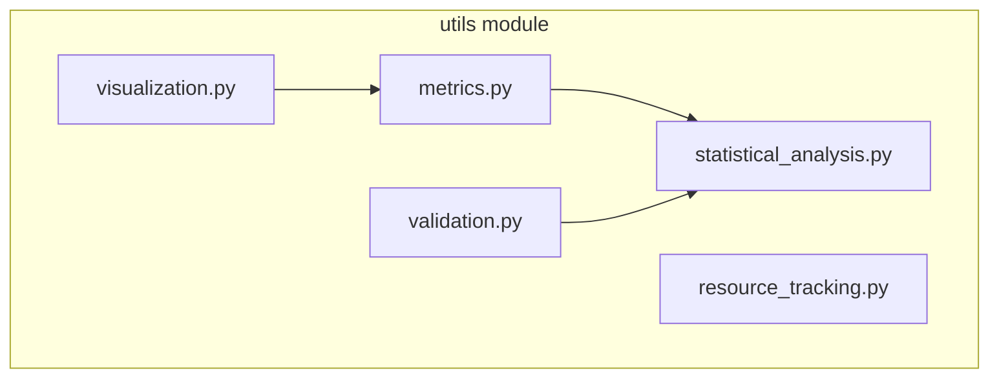

# Utils Module Documentation

## Overview

The `utils` module provides analysis, validation, resource tracking, and basic visualization tools for active inference systems.

## Module Structure



## Components

### Metrics (`metrics.py`)

Performance metrics and distance measures.

#### `calculate_kl_divergence(p, q, epsilon=1e-10)`

**Purpose**: Calculate Kullback-Leibler divergence between distributions

**Formula**: \( D_{KL}(P \| Q) = \sum_i P(i) \log \frac{P(i)}{Q(i)} \)

**Parameters**:
- `p: Array` - First distribution (true)
- `q: Array` - Second distribution (approximate)
- `epsilon: float = 1e-10` - Numerical stability constant

**Returns**: KL divergence value (float)

**Example**:
```python
from active_inference.utils import calculate_kl_divergence
import jax.numpy as jnp

p = jnp.array([0.4, 0.3, 0.3])
q = jnp.array([0.33, 0.33, 0.34])

kl = calculate_kl_divergence(p, q)
print(f"KL divergence: {kl:.4f}")  # 0 = identical, higher = more different
```

**See**: [Theory](theory.md#variational-inference)

---

#### `calculate_prediction_accuracy(predictions, actuals)`

**Purpose**: Calculate prediction accuracy (fraction correct)

**Parameters**:
- `predictions: Array[N]` - Predicted values
- `actuals: Array[N]` - Actual values

**Returns**: Accuracy in [0, 1]

**Example**:
```python
from active_inference.utils import calculate_prediction_accuracy

predicted_states = jnp.array([0, 1, 2, 1])
true_states = jnp.array([0, 1, 2, 2])

accuracy = calculate_prediction_accuracy(predicted_states, true_states)
print(f"Accuracy: {accuracy:.2%}")  # 75%
```

---

#### `calculate_entropy(distribution)`

**Purpose**: Calculate Shannon entropy of distribution

**Formula**: \( H(P) = -\sum_i P(i) \log P(i) \)

**Returns**: Entropy value (higher = more uncertain)

**Example**:
```python
from active_inference.utils import calculate_entropy

uniform = jnp.ones(4) / 4
peaked = jnp.array([0.9, 0.05, 0.03, 0.02])

print(f"Uniform entropy: {calculate_entropy(uniform):.3f}")  # High
print(f"Peaked entropy: {calculate_entropy(peaked):.3f}")    # Low
```

---

#### `calculate_mutual_information(joint_distribution)`

**Purpose**: Calculate mutual information between variables

**Formula**: \( I(X;Y) = \sum_{x,y} P(x,y) \log \frac{P(x,y)}{P(x)P(y)} \)

**Returns**: Mutual information value

---

### Statistical Analysis (`statistical_analysis.py`)

Statistical methods for data analysis.

#### `linear_regression(x, y)`

**Purpose**: Perform linear regression with full diagnostics

**Algorithm**: Ordinary least squares regression

**Parameters**:
- `x: Array[N]` - Independent variable
- `y: Array[N]` - Dependent variable

**Returns**: `RegressionResults` with:
- `slope: float` - Regression slope
- `intercept: float` - Regression intercept
- `r_squared: float` - R² coefficient
- `p_value: float` - Statistical significance
- `stderr: float` - Standard error
- `confidence_interval: Tuple[float, float]` - 95% CI

**Example**:
```python
from active_inference.utils import linear_regression
import jax.numpy as jnp

# Test relationship between free energy and reward
free_energy = jnp.array([2.5, 2.0, 1.5, 1.0, 0.5])
rewards = jnp.array([0.3, 0.5, 0.7, 0.9, 1.0])

results = linear_regression(free_energy, rewards)
print(f"Slope: {results.slope:.3f}")
print(f"R²: {results.r_squared:.3f}")
print(f"p-value: {results.p_value:.4f}")

if results.p_value < 0.05:
    print("Significant relationship!")
```

**See**: [Analysis & Validation](analysis_validation.md#linear-regression)

---

#### `pearson_correlation(x, y)`

**Purpose**: Calculate Pearson correlation with significance testing

**Formula**: \( r = \frac{\text{cov}(X,Y)}{\sigma_X \sigma_Y} \)

**Returns**: `CorrelationResults` with:
- `correlation: float` - Correlation coefficient [-1, 1]
- `p_value: float` - Statistical significance
- `confidence_interval: Tuple[float, float]` - 95% CI

**Example**:
```python
from active_inference.utils import pearson_correlation

corr_results = pearson_correlation(beliefs[:, 0], rewards)
print(f"Correlation: {corr_results.correlation:.3f}")
print(f"p-value: {corr_results.p_value:.4f}")
```

---

#### `t_test_independent(group1, group2)`

**Purpose**: Independent samples t-test

**Returns**: Dictionary with:
- `t_statistic: float`
- `p_value: float`
- `mean_diff: float`
- `cohen_d: float` - Effect size

**Example**:
```python
from active_inference.utils import t_test_independent

# Compare two agent strategies
rewards_strategy_a = jnp.array([0.5, 0.6, 0.55, 0.7])
rewards_strategy_b = jnp.array([0.8, 0.85, 0.9, 0.82])

results = t_test_independent(rewards_strategy_a, rewards_strategy_b)
print(f"t = {results['t_statistic']:.3f}")
print(f"p = {results['p_value']:.4f}")
print(f"Effect size (Cohen's d) = {results['cohen_d']:.3f}")
```

---

#### `anova_one_way(*groups)`

**Purpose**: One-way ANOVA for comparing multiple groups

**Returns**: Dictionary with:
- `f_statistic: float`
- `p_value: float`
- `df_between: int`
- `df_within: int`

**Example**:
```python
from active_inference.utils import anova_one_way

# Compare three precision levels
low_precision_rewards = jnp.array([0.5, 0.52, 0.48])
med_precision_rewards = jnp.array([0.7, 0.72, 0.68])
high_precision_rewards = jnp.array([0.85, 0.88, 0.82])

results = anova_one_way(
    low_precision_rewards,
    med_precision_rewards,
    high_precision_rewards
)

print(f"F = {results['f_statistic']:.3f}")
print(f"p = {results['p_value']:.4f}")
```

---

#### `compute_summary_statistics(data)`

**Purpose**: Compute comprehensive summary statistics

**Returns**: Dictionary with:
- `mean`, `median`, `std`, `min`, `max`
- `q25`, `q75` (quartiles)
- `skewness`, `kurtosis`

**Example**:
```python
from active_inference.utils import compute_summary_statistics

stats = compute_summary_statistics(free_energy_trajectory)
print(f"Mean FE: {stats['mean']:.3f}")
print(f"Std FE: {stats['std']:.3f}")
```

---

### Validation (`validation.py`)

Data and model validation framework.

#### `DataValidator`

**Purpose**: Comprehensive validation framework

**Methods**:

##### `validate_array(array, name, expected_shape=None, min_val=None, max_val=None)`

**Purpose**: Validate array properties

**Example**:
```python
from active_inference.utils import DataValidator

validator = DataValidator()

result = validator.validate_array(
    array=belief,
    name="belief",
    expected_shape=(4,),
    min_val=0.0,
    max_val=1.0
)

if not result.passed:
    print(f"Validation failed: {result.message}")
```

---

##### `validate_distribution(dist, name)`

**Purpose**: Validate probability distribution

**Checks**:
- ✅ All values in [0, 1]
- ✅ Sums to 1.0 (within tolerance)
- ✅ No NaN or Inf
- ✅ Non-negative

**Example**:
```python
validator.validate_distribution(belief, "posterior")
```

---

##### `validate_generative_model(model)`

**Purpose**: Validate GenerativeModel structure

**Checks**:
- ✅ A matrix: columns sum to 1
- ✅ B tensor: rows sum to 1 for each action
- ✅ D vector: sums to 1
- ✅ C vector: finite values
- ✅ Correct shapes
- ✅ No invalid values

**Example**:
```python
from active_inference.core import GenerativeModel

model = GenerativeModel(n_states=4, n_observations=2, n_actions=2)
validator.validate_generative_model(model)

if validator.all_passed():
    print("Model is valid!")
else:
    validator.print_report()
```

---

##### `validate_trajectory(beliefs, actions, observations)`

**Purpose**: Validate agent trajectory

**Checks**:
- ✅ Consistent lengths
- ✅ Valid action indices
- ✅ Valid observation indices
- ✅ Beliefs are distributions

**Example**:
```python
validator.validate_trajectory(
    beliefs=belief_history,
    actions=action_history,
    observations=obs_history
)
```

---

##### `print_report()`

**Purpose**: Print validation report

**Example**:
```python
validator.print_report()
# Output:
# Validation Report
# =================
# ✓ Distribution "belief" is valid
# ✗ Array "observation" out of range
# Total: 1 passed, 1 failed
```

---

##### `generate_html_report(output_path)`

**Purpose**: Generate HTML validation report

**Example**:
```python
validator.generate_html_report("validation_report.html")
```

---

### Resource Tracking (`resource_tracking.py`)

Monitor computational resources.

#### `ResourceTracker`

**Purpose**: Track memory and CPU usage

**Methods**:

##### `start()`

**Purpose**: Begin resource tracking

**Example**:
```python
from active_inference.utils import ResourceTracker

tracker = ResourceTracker()
tracker.start()
```

---

##### `stop()`

**Purpose**: Stop tracking

---

##### `snapshot(name)`

**Purpose**: Take resource snapshot

**Example**:
```python
# Training loop
tracker.start()

for epoch in range(10):
    train_model()
    tracker.snapshot(f"epoch_{epoch}")

tracker.stop()
```

---

##### `generate_report()`

**Purpose**: Generate resource usage report

**Returns**: String report with:
- Peak memory usage
- Average CPU usage
- Time elapsed
- Resource snapshots

**Example**:
```python
report = tracker.generate_report()
print(report)
# Output:
# Resource Usage Report
# =====================
# Duration: 45.2s
# Peak Memory: 245.3 MB
# Avg CPU: 78.5%
#
# Snapshots:
# - epoch_0: 123.4 MB
# - epoch_5: 234.5 MB
# - epoch_9: 245.3 MB
```

---

##### `save_report(path)`

**Purpose**: Save report to file

---

#### `estimate_resources(n_states, n_observations, n_actions, n_steps)`

**Purpose**: Estimate resource requirements

**Returns**: Dictionary with:
- `time_seconds: float` - Estimated time
- `memory_mb: float` - Estimated memory
- `compute_ops: int` - Number of operations

**Example**:
```python
from active_inference.utils import estimate_resources

estimates = estimate_resources(
    n_states=100,
    n_observations=50,
    n_actions=10,
    n_steps=1000
)

print(f"Estimated time: {estimates['time_seconds']:.1f}s")
print(f"Estimated memory: {estimates['memory_mb']:.1f} MB")
```

---

### Visualization (`visualization.py`)

Basic plotting utilities.

#### `plot_belief_trajectory(beliefs, true_states=None, save_path=None)`

**Purpose**: Plot belief evolution over time

**Parameters**:
- `beliefs: Array[T, n_states]` - Belief trajectory
- `true_states: Array[T]` - Optional true states
- `save_path: str` - Optional save path

**Returns**: `(fig, axes)` - Matplotlib figure and axes

**Example**:
```python
from active_inference.utils import plot_belief_trajectory

fig, axes = plot_belief_trajectory(
    beliefs=belief_history,
    true_states=state_history,
    save_path="beliefs.png"
)
```

---

#### `plot_free_energy(free_energies, save_path=None)`

**Purpose**: Plot free energy trajectory

**Example**:
```python
from active_inference.utils import plot_free_energy

fig, ax = plot_free_energy(
    free_energies=fe_history,
    save_path="free_energy.png"
)
```

---

#### `plot_action_distribution(action_probs, action_names=None)`

**Purpose**: Plot action probability distribution

---

## Usage Patterns

### Pattern 1: Analysis Pipeline

```python
from active_inference.utils import (
    linear_regression,
    pearson_correlation,
    compute_summary_statistics
)

# Collect data
fe_values = []
rewards = []

for episode in range(100):
    fe, reward = run_episode()
    fe_values.append(fe)
    rewards.append(reward)

# Analyze
fe_array = jnp.array(fe_values)
reward_array = jnp.array(rewards)

# Summary statistics
stats = compute_summary_statistics(reward_array)
print(f"Mean reward: {stats['mean']:.3f} ± {stats['std']:.3f}")

# Correlation
corr = pearson_correlation(fe_array, reward_array)
print(f"FE-Reward correlation: {corr.correlation:.3f}, p={corr.p_value:.4f}")

# Regression
reg = linear_regression(fe_array, reward_array)
print(f"Reward = {reg.intercept:.2f} + {reg.slope:.2f} × FE")
print(f"R² = {reg.r_squared:.3f}")
```

### Pattern 2: Validation Pipeline

```python
from active_inference.utils import DataValidator

validator = DataValidator()

# Validate model
validator.validate_generative_model(model)

# Validate trajectory
validator.validate_trajectory(beliefs, actions, observations)

# Check results
if validator.all_passed():
    print("All validation passed!")
else:
    validator.print_report()
    validator.generate_html_report("validation.html")
```

### Pattern 3: Resource Monitoring

```python
from active_inference.utils import ResourceTracker

tracker = ResourceTracker()
tracker.start()

# Your computation
for i in range(1000):
    result = expensive_computation()
    if i % 100 == 0:
        tracker.snapshot(f"iteration_{i}")

tracker.stop()
print(tracker.generate_report())
tracker.save_report("resources.txt")
```

---

## Cross-References

- [Architecture](architecture.md#utility-modules) - System overview
- [Analysis & Validation](analysis_validation.md) - Detailed guide
- [API Reference](api.md#utilities) - Complete API
- [Visualization Module](module_visualization.md) - Advanced plotting

---

## Examples

- [Example 12: Statistical Validation Demo](../examples/12_statistical_validation_demo.py)
- [Example 13: Coin Flip Meta Analysis](../examples/13_coin_flip_meta_analysis.py)

---

## Source Code

**Location**: `src/active_inference/utils/`
- `metrics.py` - [View Source](../src/active_inference/utils/metrics.py)
- `statistical_analysis.py` - [View Source](../src/active_inference/utils/statistical_analysis.py)
- `validation.py` - [View Source](../src/active_inference/utils/validation.py)
- `resource_tracking.py` - [View Source](../src/active_inference/utils/resource_tracking.py)
- `visualization.py` - [View Source](../src/active_inference/utils/visualization.py)
