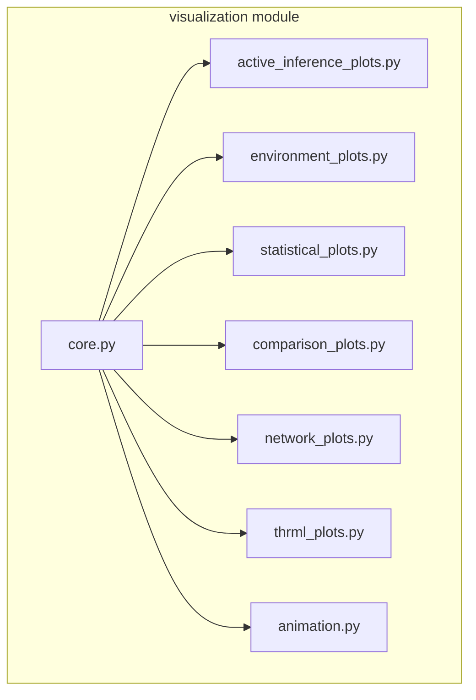

# Visualization Module Documentation

## Overview

The `visualization` module provides advanced plotting and animation capabilities for active inference systems, including belief trajectories, environment visualization, statistical plots, and THRML-specific visualizations.

## Module Structure



## Components

### Core (`core.py`)

Base plotting infrastructure and utilities.

#### `setup_plot_style()`

**Purpose**: Configure matplotlib style for consistent plots

**Usage**:
```python
from active_inference.visualization import setup_plot_style

setup_plot_style()
# All subsequent plots use consistent style
```

---

#### `save_figure(fig, path, dpi=300)`

**Purpose**: Save figure with consistent settings

---

### Active Inference Plots (`active_inference_plots.py`)

Plots specific to active inference concepts.

#### `plot_belief_evolution(beliefs, true_states=None, save_path=None)`

**Purpose**: Plot belief trajectory over time with optional ground truth

**Parameters**:
- `beliefs: Array[T, n_states]` - Belief trajectory
- `true_states: Array[T]` - Optional true state indices
- `save_path: str` - Save path

**Returns**: `(fig, axes)`

**Features**:
- Line plot for each state belief
- Vertical lines at true states
- Confidence bands
- Entropy overlay

**Example**:
```python
from active_inference.visualization import plot_belief_evolution

fig, axes = plot_belief_evolution(
    beliefs=belief_trajectory,
    true_states=ground_truth,
    save_path="belief_evolution.png"
)
```

---

#### `plot_free_energy_decomposition(accuracy, complexity, save_path=None)`

**Purpose**: Plot free energy components (accuracy vs complexity)

**Formula Display**:
\[ F = \underbrace{-E_Q[\log P(o|s)]}_{\text{Accuracy}} + \underbrace{D_{KL}[Q(s) || P(s)]}_{\text{Complexity}} \]

**Example**:
```python
from active_inference.visualization import plot_free_energy_decomposition

fig, ax = plot_free_energy_decomposition(
    accuracy=accuracy_history,
    complexity=complexity_history,
    save_path="fe_decomposition.png"
)
```

---

#### `plot_efe_components(pragmatic, epistemic, save_path=None)`

**Purpose**: Plot expected free energy components

**Shows**:
- Pragmatic value (goal-seeking)
- Epistemic value (information-seeking)
- Total EFE

**Example**:
```python
from active_inference.visualization import plot_efe_components

fig, ax = plot_efe_components(
    pragmatic=pragmatic_values,
    epistemic=epistemic_values,
    save_path="efe_components.png"
)
```

---

#### `plot_action_selection(efe_values, action_probs, action_names=None)`

**Purpose**: Visualize action selection process

**Displays**:
- EFE for each action (lower is better)
- Action probability distribution
- Selected action highlight

**Example**:
```python
from active_inference.visualization import plot_action_selection

fig, axes = plot_action_selection(
    efe_values=efes,
    action_probs=action_distribution,
    action_names=["Up", "Right", "Down", "Left"]
)
```

---

#### `plot_precision_effects(beliefs_low, beliefs_high, precision_values)`

**Purpose**: Compare belief evolution under different precision levels

**Example**:
```python
from active_inference.visualization import plot_precision_effects

fig, axes = plot_precision_effects(
    beliefs_low=low_precision_beliefs,
    beliefs_high=high_precision_beliefs,
    precision_values=[0.5, 2.0]
)
```

---

### Environment Plots (`environment_plots.py`)

Visualization for environments.

#### `plot_grid_world(env, agent_position=None, trajectory=None, save_path=None)`

**Purpose**: Visualize grid world environment

**Features**:
- Grid layout
- Goal location (green star)
- Obstacles (red squares)
- Agent position (blue circle)
- Trajectory path (arrows)

**Example**:
```python
from active_inference.visualization import plot_grid_world

fig, ax = plot_grid_world(
    env=grid_world,
    agent_position=(2, 3),
    trajectory=path_taken,
    save_path="grid_world.png"
)
```

---

#### `plot_tmaze(env, agent_position=None, cue=None)`

**Purpose**: Visualize T-maze environment

**Shows**:
- T-maze structure
- Agent position
- Cue indicator
- Reward locations

---

#### `plot_trajectory_heatmap(env, positions, save_path=None)`

**Purpose**: Heatmap of agent's position distribution

**Example**:
```python
from active_inference.visualization import plot_trajectory_heatmap

# Collect positions from multiple episodes
all_positions = []
for episode in episodes:
    all_positions.extend(episode.positions)

fig, ax = plot_trajectory_heatmap(
    env=env,
    positions=all_positions,
    save_path="position_heatmap.png"
)
```

---

### Statistical Plots (`statistical_plots.py`)

Advanced statistical visualizations.

#### `plot_scatter_with_regression(x, y, x_label=None, y_label=None, save_path=None)`

**Purpose**: Scatter plot with regression line and statistics

**Features**:
- Scatter points
- Regression line
- 95% confidence interval
- R², p-value annotations

**Example**:
```python
from active_inference.visualization import plot_scatter_with_regression

fig, ax = plot_scatter_with_regression(
    x=free_energy_values,
    y=reward_values,
    x_label="Free Energy",
    y_label="Reward",
    save_path="fe_reward_regression.png"
)
```

---

#### `plot_correlation_matrix(data_dict, save_path=None)`

**Purpose**: Correlation heatmap for multiple variables

**Parameters**:
- `data_dict: Dict[str, Array]` - Named variables

**Example**:
```python
from active_inference.visualization import plot_correlation_matrix

data = {
    'Free Energy': fe_values,
    'Reward': rewards,
    'Entropy': entropies,
    'KL Divergence': kl_values
}

fig, ax = plot_correlation_matrix(data, save_path="correlations.png")
```

---

#### `plot_residuals(x, y, save_path=None)`

**Purpose**: Residual diagnostic plots

**Shows**:
- Residuals vs fitted
- Q-Q plot
- Scale-location plot
- Residuals vs leverage

**Example**:
```python
from active_inference.visualization import plot_residuals

fig, axes = plot_residuals(
    x=predictions,
    y=actuals,
    save_path="residuals.png"
)
```

---

#### `plot_distribution_comparison(dist1, dist2, labels=None)`

**Purpose**: Compare two probability distributions

**Shows**:
- Bar chart comparison
- KL divergence
- Jensen-Shannon divergence

---

### Comparison Plots (`comparison_plots.py`)

Comparative analysis visualizations.

#### `plot_agent_comparison(agent_results, metric='reward', save_path=None)`

**Purpose**: Compare multiple agents on a metric

**Parameters**:
- `agent_results: Dict[str, Array]` - Results per agent
- `metric: str` - Metric to compare

**Example**:
```python
from active_inference.visualization import plot_agent_comparison

results = {
    'Low Precision': low_prec_rewards,
    'Medium Precision': med_prec_rewards,
    'High Precision': high_prec_rewards
}

fig, ax = plot_agent_comparison(
    agent_results=results,
    metric='reward',
    save_path="agent_comparison.png"
)
```

---

#### `plot_ablation_study(baseline, ablations, save_path=None)`

**Purpose**: Visualize ablation study results

---

#### `plot_learning_curves(training_curves, save_path=None)`

**Purpose**: Plot learning curves for multiple runs

**Shows**:
- Mean trajectory
- Confidence intervals
- Individual runs (faded)

---

### Network Plots (`network_plots.py`)

Visualize model structure and connectivity.

#### `plot_generative_model(model, save_path=None)`

**Purpose**: Visualize generative model structure

**Shows**:
- A matrix (observation likelihood) heatmap
- B tensor (transitions) as grid of heatmaps
- C vector (preferences) bar chart
- D vector (prior) bar chart

**Example**:
```python
from active_inference.visualization import plot_generative_model

fig, axes = plot_generative_model(
    model=generative_model,
    save_path="model_structure.png"
)
```

---

#### `plot_belief_network(beliefs, connections, save_path=None)`

**Purpose**: Network graph of belief states

---

#### `plot_factor_graph(factors, variables, save_path=None)`

**Purpose**: Factor graph visualization for THRML models

---

### THRML Plots (`thrml_plots.py`)

THRML-specific visualizations.

#### `plot_sampling_convergence(samples, save_path=None)`

**Purpose**: Convergence diagnostics for MCMC sampling

**Shows**:
- Trace plots
- Autocorrelation
- Effective sample size
- Gelman-Rubin statistic

**Example**:
```python
from active_inference.visualization import plot_sampling_convergence

fig, axes = plot_sampling_convergence(
    samples=thrml_samples,
    save_path="sampling_convergence.png"
)
```

---

#### `plot_block_structure(blocks, save_path=None)`

**Purpose**: Visualize THRML block structure

---

#### `plot_energy_landscape(factor, state_range, save_path=None)`

**Purpose**: Plot energy function landscape

**Example**:
```python
from active_inference.visualization import plot_energy_landscape

fig, ax = plot_energy_landscape(
    factor=observation_factor,
    state_range=range(model.n_states),
    save_path="energy_landscape.png"
)
```

---

### Animation (`animation.py`)

Animated visualizations.

#### `animate_agent_behavior(trajectory, env, save_path=None, fps=10)`

**Purpose**: Create animated video of agent behavior

**Parameters**:
- `trajectory: List[State]` - State trajectory
- `env: Environment` - Environment
- `save_path: str` - Save path (.gif or .mp4)
- `fps: int` - Frames per second

**Example**:
```python
from active_inference.visualization import animate_agent_behavior

# Collect trajectory
trajectory = []
for step in range(100):
    trajectory.append(env.state)
    # ... agent step

# Animate
animate_agent_behavior(
    trajectory=trajectory,
    env=env,
    save_path="agent_behavior.gif",
    fps=10
)
```

---

#### `animate_belief_evolution(beliefs, save_path=None)`

**Purpose**: Animated belief distribution evolution

**Example**:
```python
from active_inference.visualization import animate_belief_evolution

animate_belief_evolution(
    beliefs=belief_trajectory,
    save_path="beliefs.gif"
)
```

---

#### `animate_sampling_process(samples, save_path=None)`

**Purpose**: Visualize THRML sampling process

---

## Usage Patterns

### Pattern 1: Complete Analysis Visualization

```python
from active_inference import visualization as viz

# Belief evolution
viz.plot_belief_evolution(beliefs, true_states, save_path="beliefs.png")

# Free energy
viz.plot_free_energy_decomposition(accuracy, complexity, save_path="fe.png")

# Environment
viz.plot_grid_world(env, trajectory=path, save_path="env.png")

# Statistics
viz.plot_scatter_with_regression(fe_values, rewards, save_path="fe_reward.png")
```

### Pattern 2: Comparison Study

```python
from active_inference import visualization as viz

# Compare agents
results = {
    'Baseline': baseline_rewards,
    'THRML': thrml_rewards,
    'Variational': var_rewards
}

viz.plot_agent_comparison(results, metric='reward')
viz.plot_learning_curves(training_curves)
```

### Pattern 3: Animation Creation

```python
from active_inference import visualization as viz

# Record trajectory
trajectory = run_agent_episode(agent, env)

# Create animation
viz.animate_agent_behavior(
    trajectory=trajectory,
    env=env,
    save_path="episode.gif",
    fps=5
)
```

---

## Customization

### Plot Style Customization

```python
from active_inference.visualization import setup_plot_style
import matplotlib.pyplot as plt

# Custom style
setup_plot_style()
plt.rcParams['figure.figsize'] = (12, 8)
plt.rcParams['font.size'] = 14
```

### Custom Color Schemes

```python
from active_inference.visualization import PLOT_COLORS

# Use predefined colors
colors = PLOT_COLORS['active_inference']
# ['#1f77b4', '#ff7f0e', '#2ca02c', ...]
```

---

## Cross-References

- [Architecture](architecture.md#visualization-modules) - System overview
- [Utils Module](module_utils.md) - Basic plotting utilities
- [Analysis & Validation](analysis_validation.md) - Statistical plots
- [API Reference](api.md#visualization) - Complete API

---

## Examples

- [Example 02: Grid World Agent](../examples/02_grid_world_agent.py) - Environment plots
- [Example 03: Precision Control](../examples/03_precision_control.py) - Precision effects
- [Example 12: Statistical Validation](../examples/12_statistical_validation_demo.py) - Statistical plots

---

## Source Code

**Location**: `src/active_inference/visualization/`
- `core.py` - [View Source](../src/active_inference/visualization/core.py)
- `active_inference_plots.py` - [View Source](../src/active_inference/visualization/active_inference_plots.py)
- `environment_plots.py` - [View Source](../src/active_inference/visualization/environment_plots.py)
- `statistical_plots.py` - [View Source](../src/active_inference/visualization/statistical_plots.py)
- `comparison_plots.py` - [View Source](../src/active_inference/visualization/comparison_plots.py)
- `network_plots.py` - [View Source](../src/active_inference/visualization/network_plots.py)
- `thrml_plots.py` - [View Source](../src/active_inference/visualization/thrml_plots.py)
- `animation.py` - [View Source](../src/active_inference/visualization/animation.py)
