# Documentation Navigation Guide

> **Active Inference + THRML Library Documentation**

## Quick Access

| Category | Document | Description |
|----------|----------|-------------|
| 🚀 **Start Here** | [Getting Started](getting_started.md) | Installation, first agent, basics |
| 📐 **Theory** | [Theory Guide](theory.md) | Mathematical foundations |
| 🏗️ **Architecture** | [Architecture](architecture.md) | System design and structure |
| 📚 **API** | [API Reference](api.md) | Quick API lookup |
| 📖 **Modules** | [Module Index](module_index.md) | Complete module documentation |
| 🔧 **Workflows** | [Workflows & Patterns](workflows_patterns.md) | Practical patterns |
| 🔗 **THRML** | [THRML Integration](thrml_integration.md) | THRML methods reference |
| 📊 **Analysis** | [Analysis & Validation](analysis_validation.md) | Statistical tools |

---

## Documentation Map

```mermaid
graph TB
    ROOT[Documentation Home]

    ROOT --> LEARN[📚 Learning Track]
    ROOT --> BUILD[🔨 Building Track]
    ROOT --> REF[📖 Reference Track]
    ROOT --> ADV[🚀 Advanced Track]

    LEARN --> L1[1. Getting Started]
    LEARN --> L2[2. Theory]
    LEARN --> L3[3. Examples]
    LEARN --> L4[4. Core Concepts]

    BUILD --> B1[1. First Agent]
    BUILD --> B2[2. Custom Models]
    BUILD --> B3[3. Environments]
    BUILD --> B4[4. Integration]

    REF --> R1[Module Index]
    REF --> R2[API Reference]
    REF --> R3[Architecture]
    REF --> R4[Theory]

    ADV --> A1[THRML Integration]
    ADV --> A2[Performance]
    ADV --> A3[Hierarchical]
    ADV --> A4[Custom Components]

    style LEARN fill:#e1f5e1
    style BUILD fill:#e1e5f5
    style REF fill:#f5f0e1
    style ADV fill:#f5e1e1
```

---

## Learning Paths

### Path 1: Complete Beginner

**Goal**: Understand active inference and run your first agent

1. ⏱️ 5 min: Read [Getting Started: Core Concepts](getting_started.md#core-concepts)
2. ⏱️ 10 min: Read [Theory: Overview](theory.md#overview)
3. ⏱️ 15 min: Run [Example 01: Basic Inference](../examples/01_basic_inference.py)
4. ⏱️ 20 min: Run [Example 02: Grid World Agent](../examples/02_grid_world_agent.py)
5. ⏱️ 10 min: Review [Workflows: First Agent](workflows_patterns.md#creating-your-first-agent)

**Total Time**: ~1 hour

**Next**: Path 2 or start building custom agents

---

### Path 2: Practical Developer

**Goal**: Build and deploy active inference agents

1. ⏱️ 10 min: Review [Architecture Overview](architecture.md#system-architecture)
2. ⏱️ 15 min: Study [Core Module](module_core.md)
3. ⏱️ 15 min: Study [Agent Module](module_agents.md)
4. ⏱️ 20 min: Follow [Workflows: Training Loop](workflows_patterns.md#training-loop-pattern)
5. ⏱️ 30 min: Build custom agent using patterns

**Total Time**: ~1.5 hours

**Next**: Path 3 for optimization or Path 4 for THRML

---

### Path 3: Performance Engineer

**Goal**: Optimize and scale active inference systems

1. ⏱️ 10 min: Read [Performance Guide](performance.md)
2. ⏱️ 15 min: Review [Workflows: Optimization](workflows_patterns.md#optimization-patterns)
3. ⏱️ 10 min: Study [Resource Tracking](module_utils.md#resource-tracking)
4. ⏱️ 20 min: Implement caching and JIT compilation
5. ⏱️ 15 min: Profile with [Resource Tracker](workflows_patterns.md#memory-optimization)

**Total Time**: ~1-2 hours

**Next**: Advanced optimization techniques

---

### Path 4: THRML Integration Specialist

**Goal**: Master THRML integration for advanced inference

1. ⏱️ 20 min: Read [THRML Integration Overview](thrml_integration.md#overview)
2. ⏱️ 30 min: Study [THRML Components Reference](thrml_integration.md#thrml-components-reference)
3. ⏱️ 15 min: Review [Integration Patterns](thrml_integration.md#integration-patterns)
4. ⏱️ 45 min: Run [Example 11: THRML Comprehensive](../examples/11_thrml_comprehensive.py)
5. ⏱️ 30 min: Build custom THRML factors

**Total Time**: ~2-3 hours

**Next**: Advanced THRML sampling and hardware acceleration

---

### Path 5: Researcher

**Goal**: Deep understanding of theory and implementation

1. ⏱️ 30 min: Read [Complete Theory Guide](theory.md)
2. ⏱️ 45 min: Study all [Module Documentation](module_index.md)
3. ⏱️ 30 min: Review [Architecture in Detail](architecture.md)
4. ⏱️ 60 min: Run all examples and analyze code
5. ⏱️ 45 min: Read [Statistical Analysis](analysis_validation.md)

**Total Time**: ~3-4 hours

**Next**: Contribute to library or build novel applications

---

## Module Navigation

### By Component Layer

#### Layer 1: Foundation
1. [Core Module](module_core.md)
   - GenerativeModel
   - Free Energy
   - Precision

#### Layer 2: Inference
2. [Inference Module](module_inference.md)
   - Variational inference
   - THRML inference

3. [Model Module](module_models.md)
   - Model builders
   - Pre-built models

#### Layer 3: Agents & Environments
4. [Agent Module](module_agents.md)
   - ActiveInferenceAgent
   - Planning algorithms

5. [Environment Module](module_environments.md)
   - GridWorld
   - TMaze

#### Layer 4: Analysis & Visualization
6. [Utils Module](module_utils.md)
   - Metrics
   - Validation
   - Statistics

7. [Visualization Module](module_visualization.md)
   - Plotting
   - Animation

---

## Task-Based Navigation

### Common Tasks

| Task | Primary Document | Secondary Documents |
|------|------------------|---------------------|
| Install library | [Getting Started](getting_started.md#installation) | [Workflows](workflows_patterns.md#project-setup) |
| Create first agent | [Workflows: First Agent](workflows_patterns.md#creating-your-first-agent) | [Getting Started](getting_started.md#active-inference-agent) |
| Build custom model | [Custom Models](custom_models.md) | [Model Module](module_models.md) |
| Validate data | [Analysis & Validation](analysis_validation.md#data-validation) | [Utils Module](module_utils.md#validation) |
| Plot results | [Visualization Module](module_visualization.md) | [Workflows: Debugging](workflows_patterns.md#visualization-debugging) |
| Optimize performance | [Performance Guide](performance.md) | [Workflows: Optimization](workflows_patterns.md#optimization-patterns) |
| Integrate THRML | [THRML Integration](thrml_integration.md) | [Inference Module](module_inference.md#thrml-inference) |
| Debug issues | [Workflows: Debugging](workflows_patterns.md#debugging-patterns) | [Analysis & Validation](analysis_validation.md) |

---

## THRML Integration Navigation

### THRML Component Reference

| Component | THRML Module | Documentation |
|-----------|--------------|---------------|
| Block Management | `thrml.block_management` | [Blocks](thrml_integration.md#block-management) |
| Block Sampling | `thrml.block_sampling` | [Sampling](thrml_integration.md#block-sampling) |
| Factors | `thrml.factor` | [Factors](thrml_integration.md#factors) |
| Conditional Samplers | `thrml.conditional_samplers` | [Conditionals](thrml_integration.md#conditional-samplers) |
| PGM Nodes | `thrml.pgm` | [PGM Nodes](thrml_integration.md#pgm-nodes) |
| Observers | `thrml.observers` | [Observers](thrml_integration.md#observers) |
| Discrete EBM | `thrml.models.discrete_ebm` | [Discrete EBM](thrml_integration.md#discrete-ebm-models) |

### Integration Patterns

- [Pattern 1: State Inference](thrml_integration.md#pattern-1-state-inference-with-thrml)
- [Pattern 2: Trajectory Sampling](thrml_integration.md#pattern-2-trajectory-sampling)
- [Pattern 3: Precision-Weighted Factors](thrml_integration.md#pattern-3-precision-weighted-factors)

---

## Example Navigation

### By Difficulty

#### Beginner (Examples 01-03)
- 01: Basic Inference
- 02: Grid World Agent
- 03: Precision Control

#### Intermediate (Examples 04-08)
- 04: MDP Example
- 05: POMDP Example
- 06: Coin Flip Inference
- 07: Matrix Performance
- 08: Signal Processing

#### Advanced (Examples 09-13)
- 09: Control Theory
- 10: Active Inference Fundamentals
- 11: THRML Comprehensive
- 12: Statistical Validation Demo
- 13: Coin Flip Meta Analysis

### By Topic

- **Core Concepts**: 01, 10
- **Agents**: 02, 04, 05
- **Precision**: 03
- **THRML**: 06, 11, 13
- **Analysis**: 07, 12
- **Applications**: 08, 09

---

## Search Index

### By Keyword

**Active Inference**
- [Theory](theory.md) | [Core](module_core.md) | [Examples](../examples/)

**Agent**
- [Agent Module](module_agents.md) | [Workflows](workflows_patterns.md#creating-your-first-agent)

**Belief**
- [Inference](module_inference.md) | [Theory](theory.md#perception-as-inference)

**Free Energy**
- [Core Module](module_core.md#free-energy) | [Theory](theory.md#the-free-energy-principle)

**Generative Model**
- [Core Module](module_core.md#generative-model) | [Theory](theory.md#generative-models)

**Inference**
- [Inference Module](module_inference.md) | [THRML Inference](thrml_integration.md)

**Planning**
- [Agent Module](module_agents.md#planning) | [Planning Algorithms](planning_algorithms.md)

**Precision**
- [Core Module](module_core.md#precision) | [Precision Control](precision_control.md)

**THRML**
- [THRML Integration](thrml_integration.md) | [Inference](module_inference.md#thrml-inference)

**Validation**
- [Analysis & Validation](analysis_validation.md) | [Utils Module](module_utils.md#validation)

**Visualization**
- [Visualization Module](module_visualization.md) | [Analysis & Validation](analysis_validation.md)

---

## External Links

### Parent Library
- [THRML Documentation](../../docs/index.md)
- [THRML Examples](../../examples/)
- [THRML Tests](../../tests/)

### Resources
- [Active Inference Textbook](https://mitpress.mit.edu/9780262045353/)
- [Free Energy Principle](https://www.fil.ion.ucl.ac.uk/~karl/)
- [JAX Documentation](https://jax.readthedocs.io/)

---

## Documentation Maintenance

### For Contributors

#### Adding New Documentation
1. Create file in `docs/` directory
2. Add navigation links at top
3. Include cross-references
4. Update this navigation guide
5. Update `README.md`

#### Updating Existing Docs
1. Update content
2. Check all cross-references
3. Update navigation links if needed
4. Verify examples still work
5. Update modification date

#### Documentation Standards
- Use Mermaid diagrams for workflows
- Include code examples
- Add cross-references
- Maintain navigation bar
- Use consistent formatting

---

> **Legend**: ⏱️ = Estimated time | 🚀 = Quick start | 📚 = In-depth | 🔧 = Practical | 🔗 = Integration

> **Start Your Journey**: [Getting Started](getting_started.md) | **Jump to Reference**: [Module Index](module_index.md) | **Integrate THRML**: [THRML Guide](thrml_integration.md)
