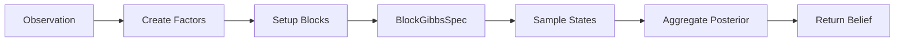

# THRML Integration Guide

## Overview

This guide explains how the active_inference library integrates with THRML (Thermodynamic ML) for efficient probabilistic inference using block Gibbs sampling and energy-based models.

## THRML Components Reference

### Block Management (`thrml.block_management`)

THRML organizes variables into blocks for efficient sampling.

#### `Block`

**Purpose**: Container for related nodes in the probabilistic model

**Attributes**:
- `nodes`: List of nodes (e.g., `CategoricalNode`, `SpinNode`)
- `name`: Block identifier

**Usage in Active Inference**:
```python
from thrml import Block, CategoricalNode

# Create block for hidden states
state_block = Block(
    nodes=[CategoricalNode(n_categories=model.n_states)],
    name="hidden_states"
)
```

**See**: `thrml/block_management.py` | [Block Management Details](thrml_blocks.md)

#### `BlockSpec`

**Purpose**: Specification of block structure

**Attributes**:
- `blocks`: List of all blocks
- `block_sizes`: Size of each block

**Usage**:
```python
from thrml import BlockSpec

spec = BlockSpec.from_blocks([state_block, obs_block])
```

**See**: [THRML Blocks Documentation](thrml_blocks.md)

#### Key Functions

- `get_node_locations(blocks)`: Map nodes to global indices
- `make_empty_block_state(blocks)`: Initialize block state
- `block_state_to_global(block_state, spec)`: Convert to global state
- `from_global_state(global_state, spec)`: Extract block state
- `verify_block_state(block_state, spec)`: Validate state structure

### Block Sampling (`thrml.block_sampling`)

Core sampling algorithms for probabilistic inference.

#### `BlockGibbsSpec`

**Purpose**: Specification of which blocks to sample

**Attributes**:
- `free`: List of blocks to sample (free variables)
- `clamped`: List of blocks to hold fixed (observed variables)

**Usage in Active Inference**:
```python
from thrml import BlockGibbsSpec

# Inference: states free, observations clamped
inference_spec = BlockGibbsSpec(
    free=[state_block],
    clamped=[obs_block]
)

# Prediction: both free
prediction_spec = BlockGibbsSpec(
    free=[state_block, next_state_block],
    clamped=[]
)
```

**See**: `thrml/block_sampling.py`

#### `SamplingSchedule`

**Purpose**: Controls sampling order and strategy

**Attributes**:
- `schedule`: Sequence of block indices to sample
- `n_sweeps`: Number of full sampling sweeps

**Usage**:
```python
from thrml import SamplingSchedule

schedule = SamplingSchedule(
    schedule=[0],  # Sample block 0
    n_sweeps=10    # 10 complete sweeps
)
```

#### `BlockSamplingProgram`

**Purpose**: Complete sampling program with factors

**Attributes**:
- `spec`: `BlockGibbsSpec` for free/clamped blocks
- `factors`: List of energy factors
- `schedule`: `SamplingSchedule` for sampling order

**Usage**:
```python
from thrml import BlockSamplingProgram

program = BlockSamplingProgram(
    spec=gibbs_spec,
    factors=factor_list,
    schedule=schedule
)

samples = program.sample(key, initial_state, n_samples=1000)
```

**See**: [Block Sampling Guide](thrml_sampling.md)

#### Key Functions

- `sample_states(key, spec, factors, n_samples)`: Sample from distribution
- `sample_blocks(key, state, spec, factors, schedule)`: Single sampling sweep
- `sample_single_block(key, state, block_idx, factors)`: Sample one block
- `sample_with_observation(key, obs, factors, n_samples)`: Conditional sampling

### Factors (`thrml.factor`)

Energy functions defining the probabilistic model.

#### `AbstractFactor`

**Purpose**: Base class for energy factors

**Methods**:
- `energy(state)`: Compute energy for given state
- `log_prob(state)`: Compute log probability (= -energy)
- `involved_blocks()`: Return blocks this factor depends on

**Usage in Active Inference**:
```python
from thrml import AbstractFactor
import jax.numpy as jnp

class ObservationFactor(AbstractFactor):
    """Factor for P(o|s) in active inference."""

    def __init__(self, A_matrix, observation):
        self.A = A_matrix  # [n_obs, n_states]
        self.obs = observation

    def energy(self, state):
        # Energy = -log P(o|s)
        s = state['hidden_states']  # State index
        likelihood = self.A[self.obs, s]
        return -jnp.log(likelihood + 1e-10)

    def involved_blocks(self):
        return ['hidden_states']
```

**See**: `thrml/factor.py` | [Factor Construction Guide](thrml_factors.md)

#### `WeightedFactor`

**Purpose**: Factor with adjustable weight (for precision)

**Attributes**:
- `factor`: Underlying `AbstractFactor`
- `weight`: Precision weight

**Usage**:
```python
from thrml import WeightedFactor

# High precision = strong influence
precise_factor = WeightedFactor(
    factor=obs_factor,
    weight=model.precision.sensory_precision
)
```

#### `FactorSamplingProgram`

**Purpose**: Sampling program using factors

**Methods**:
- `create(blocks, factors)`: Create program from components
- `sample(key, n_samples)`: Generate samples

**Usage**:
```python
from thrml import FactorSamplingProgram

program = FactorSamplingProgram.create(
    blocks=[state_block],
    factors=[obs_factor, prior_factor]
)

samples = program.sample(key, n_samples=1000)
```

**See**: [Advanced Factor Usage](thrml_factors_advanced.md)

### Conditional Samplers (`thrml.conditional_samplers`)

Samplers for specific node types.

#### `AbstractConditionalSampler`

**Purpose**: Base class for conditional sampling

**Methods**:
- `sample(key, conditional_params)`: Sample from conditional distribution
- `log_prob(value, conditional_params)`: Compute conditional log probability

#### `SoftmaxConditional`

**Purpose**: Sample categorical variables via softmax

**Usage in Active Inference**:
```python
from thrml.models.discrete_ebm import CategoricalGibbsConditional

# For state inference
conditional = CategoricalGibbsConditional(
    n_categories=model.n_states,
    factors=inference_factors
)

# Sample state given observations
state_sample = conditional.sample(key, current_state)
```

**See**: `thrml/conditional_samplers.py`

#### `BernoulliConditional`

**Purpose**: Sample binary variables

**See**: [Conditional Samplers Guide](thrml_conditionals.md)

### PGM Nodes (`thrml.pgm`)

Node types for probabilistic graphical models.

#### `AbstractNode`

**Purpose**: Base class for nodes

**Attributes**:
- `name`: Node identifier
- `shape`: Node dimensionality

#### `CategoricalNode`

**Purpose**: Discrete categorical random variable

**Attributes**:
- `n_categories`: Number of discrete states
- `name`: Variable name

**Usage in Active Inference**:
```python
from thrml import CategoricalNode

# Hidden state variable
state_node = CategoricalNode(
    n_categories=model.n_states,
    name="state_t"
)

# Observation variable
obs_node = CategoricalNode(
    n_categories=model.n_observations,
    name="obs_t"
)
```

**See**: `thrml/pgm.py`

#### `SpinNode`

**Purpose**: Binary spin variable (+1/-1)

**Usage**: For Ising models and binary factor graphs

**See**: [Spin Models Guide](../../docs/index.md)

### Observers (`thrml.observers`)

Monitor sampling process and collect statistics.

#### `AbstractObserver`

**Purpose**: Base class for observers

**Methods**:
- `observe(state, step)`: Record observation
- `finalize()`: Compute final statistics

#### `StateObserver`

**Purpose**: Record state trajectory

**Usage**:
```python
from thrml import StateObserver

observer = StateObserver()

# During sampling
for step in range(n_samples):
    state = sample_step(...)
    observer.observe(state, step)

# Get trajectory
trajectory = observer.finalize()
```

**See**: `thrml/observers.py`

#### `MomentAccumulatorObserver`

**Purpose**: Accumulate moments (mean, variance) online

**Usage**:
```python
from thrml import MomentAccumulatorObserver

observer = MomentAccumulatorObserver()

# Accumulate samples
for sample in samples:
    observer.observe(sample, step)

# Get statistics
stats = observer.finalize()
mean = stats['mean']
variance = stats['variance']
```

**See**: [Observer Patterns](thrml_observers.md)

### Discrete EBM Models (`thrml.models.discrete_ebm`)

Energy-based models for discrete variables.

#### `CategoricalEBMFactor`

**Purpose**: Energy factor for categorical variables

**Usage**:
```python
from thrml.models.discrete_ebm import CategoricalEBMFactor

factor = CategoricalEBMFactor(
    energy_matrix=energy_matrix,  # [n_categories]
    node_name="state"
)
```

#### `CategoricalGibbsConditional`

**Purpose**: Gibbs conditional for categorical sampling

**Usage in Active Inference**:
```python
from thrml.models.discrete_ebm import CategoricalGibbsConditional

conditional = CategoricalGibbsConditional(
    n_categories=model.n_states,
    factors=[likelihood_factor, prior_factor]
)

# Conditional samples: P(s | observations, other factors)
sample = conditional.sample(key, current_state)
```

**See**: `thrml/models/discrete_ebm.py`

## Integration Patterns

### Pattern 1: State Inference with THRML



**Implementation**:
```python
from thrml import Block, CategoricalNode, BlockGibbsSpec, sample_states

def thrml_inference(observation, model, n_samples=1000):
    """Infer states using THRML sampling."""

    # 1. Create blocks
    state_block = Block(
        nodes=[CategoricalNode(n_categories=model.n_states)],
        name="states"
    )

    # 2. Create factors
    obs_factor = ObservationFactor(model.A, observation)
    prior_factor = PriorFactor(model.D)

    # 3. Setup sampling
    spec = BlockGibbsSpec(
        free=[state_block],
        clamped=[]
    )

    # 4. Sample
    samples = sample_states(
        key, spec,
        factors=[obs_factor, prior_factor],
        n_samples=n_samples
    )

    # 5. Aggregate to posterior
    state_counts = jnp.bincount(samples['states'], length=model.n_states)
    posterior = state_counts / n_samples

    return posterior
```

**See**: [Inference with THRML](inference_methods.md#thrml-sampling)

### Pattern 2: Trajectory Sampling

```python
from thrml import sample_states, BlockGibbsSpec

def sample_trajectory(model, actions, n_samples=100):
    """Sample state trajectories given action sequence."""

    T = len(actions)

    # Create temporal blocks
    state_blocks = [
        Block(nodes=[CategoricalNode(model.n_states)], name=f"state_{t}")
        for t in range(T + 1)
    ]

    # Create transition factors
    factors = []
    for t, action in enumerate(actions):
        transition_factor = TransitionFactor(
            model.B[:, :, action],
            state_blocks[t],
            state_blocks[t + 1]
        )
        factors.append(transition_factor)

    # Sample
    spec = BlockGibbsSpec(free=state_blocks, clamped=[])
    samples = sample_states(key, spec, factors, n_samples)

    return samples
```

**See**: [Trajectory Sampling](planning_algorithms.md#trajectory-sampling)

### Pattern 3: Precision-Weighted Factors

```python
from thrml import WeightedFactor

def create_precision_weighted_factors(model, observation, precision):
    """Create factors with precision weighting."""

    # Observation likelihood with sensory precision
    obs_factor = WeightedFactor(
        factor=ObservationFactor(model.A, observation),
        weight=precision.sensory_precision
    )

    # State prior with state precision
    prior_factor = WeightedFactor(
        factor=PriorFactor(model.D),
        weight=precision.state_precision
    )

    return [obs_factor, prior_factor]
```

**See**: [Precision Control](precision_control.md)

## Integration Status

### Implemented Features

✅ **Block Management**
- State representation as `CategoricalNode`
- Block creation and specification
- Block state conversion utilities

✅ **Basic Sampling**
- `sample_states` integration
- `BlockGibbsSpec` usage
- Sampling schedule configuration

✅ **Template Factors**
- Factor interface defined
- Example observation factors
- Factor combination patterns

✅ **ThrmlInferenceEngine**
- Basic sampling-based inference
- Posterior aggregation
- JAX integration

### Planned Features

🔄 **Advanced Factors**
- Complete generative model factors
- Hierarchical factor structures
- Learned factor parameters

🔄 **Observers Integration**
- State trajectory monitoring
- Convergence diagnostics
- Quality metrics

🔄 **Batch Processing**
- Parallel inference for multiple observations
- Batch trajectory sampling
- Vectorized factor evaluation

🔄 **Hardware Acceleration**
- Extropic hardware preparation
- Optimized sampling kernels
- Large-scale inference

**See**: [Integration Roadmap](integration_roadmap.md)

## Performance Comparison

### Variational vs THRML Inference

| Metric | Variational | THRML Sampling |
|--------|-------------|----------------|
| Speed (small models) | ⚡ Very fast (< 1ms) | 🐢 Slower (10-100ms) |
| Speed (large models) | 🐢 Degrades | ⚡ Scales well |
| Accuracy (simple) | ✅ Exact | ✅ Accurate |
| Accuracy (complex) | ⚠️ Approximate | ✅ More accurate |
| Memory (small) | ✅ Minimal | ⚠️ Moderate |
| Memory (large) | ❌ Grows fast | ✅ Controlled |
| Hierarchical models | ⚠️ Limited | ✅ Natural fit |

**Recommendations**:
- **Variational**: Real-time control, small state spaces, simple models
- **THRML**: Offline analysis, large state spaces, complex/hierarchical models

**See**: [Performance Guide](performance.md)

## Example: Complete Integration

```python
import jax
import jax.numpy as jnp
from active_inference.core import GenerativeModel, Precision
from active_inference.inference import ThrmlInferenceEngine

# 1. Create generative model
model = GenerativeModel(
    n_states=10,
    n_observations=8,
    n_actions=4
)

# 2. Create THRML inference engine
engine = ThrmlInferenceEngine(
    model=model,
    n_samples=1000,
    n_warmup=100,
    precision=Precision(sensory_precision=2.0)
)

# 3. Perform inference
key = jax.random.key(42)
observation = 3

posterior = engine.infer_with_sampling(key, observation)
print(f"Posterior: {posterior}")

# 4. Sample trajectories
actions = [0, 1, 0, 1]
trajectories = engine.sample_trajectory(key, actions, n_samples=100)
print(f"Trajectory shape: {trajectories.shape}")
```

**See**: [Complete Examples](../examples/11_thrml_comprehensive.py)

## Cross-References

### Active Inference Documentation
- [Architecture Overview](architecture.md)
- [Inference Methods](inference_methods.md)
- [Core Module](module_core.md)
- [Inference Module](module_inference.md)

### THRML Documentation
- [THRML Main Docs](../../docs/index.md)
- [Block Sampling Details](thrml_sampling.md)
- [Factor Construction](thrml_factors.md)
- [Observer Patterns](thrml_observers.md)

### Examples
- [Example 11: THRML Comprehensive](../examples/11_thrml_comprehensive.py)
- [Example 12: Statistical Validation](../examples/12_statistical_validation_demo.py)

## Further Reading

- [THRML Paper/Docs](https://docs.thrml.ai/)
- [Active Inference and Energy-Based Models](theory.md)
- [Extropic Hardware Integration](integration_roadmap.md#hardware-acceleration)
