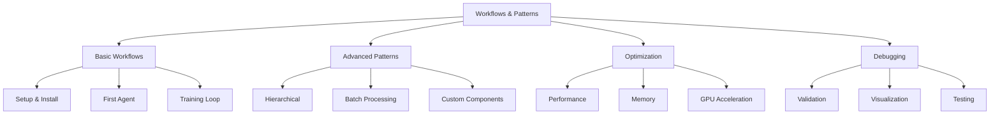

# Workflow and Patterns Guide

## Overview

This guide provides comprehensive workflows and patterns for common active inference tasks, from basic setup to advanced applications.

## Table of Contents



## Basic Workflows

### 1. Project Setup

#### Initial Setup

```bash
# Navigate to active_inference directory
cd active_inference

# Run setup script (uses uv)
./scripts/setup.sh

# Or manual setup
uv venv
source .venv/bin/activate  # On Windows: .venv\Scripts\activate
uv pip install -e ".[all]"

# Verify installation
python3 -c "import active_inference; print(active_inference.__version__)"
```

**See**: [Getting Started](getting_started.md#installation)

---

### 2. Creating Your First Agent

#### Step-by-Step Workflow

```python
# Step 1: Imports
import jax
import jax.numpy as jnp
from active_inference.core import GenerativeModel, Precision
from active_inference.agents import ActiveInferenceAgent
from active_inference.environments import GridWorld, GridWorldConfig
from active_inference.models import build_grid_world_model

# Step 2: Create environment
config = GridWorldConfig(
    size=5,
    goal_location=(4, 4),
    start_location=(0, 0)
)
env = GridWorld(config=config)

# Step 3: Build generative model
model = build_grid_world_model(config, goal_preference_strength=2.0)

# Step 4: Configure precision
precision = Precision(
    sensory_precision=1.0,
    action_precision=2.0
)

# Step 5: Create agent
agent = ActiveInferenceAgent(
    model=model,
    precision=precision,
    planning_horizon=1,
    inference_iterations=16
)

# Step 6: Run episode
key = jax.random.key(42)
agent_state = agent.reset()
obs = env.reset(key)
total_reward = 0

for step in range(100):
    # Perception-action cycle
    key, subkey = jax.random.split(key)
    action, agent_state, fe = agent.step(subkey, obs, agent_state)

    # Environment step
    key, subkey = jax.random.split(key)
    obs, reward, done = env.step(subkey, action)

    total_reward += reward

    print(f"Step {step}: action={action}, fe={fe:.3f}, reward={reward:.3f}")

    if done:
        print(f"Goal reached! Total reward: {total_reward:.3f}")
        break

# Step 7: Analyze results
from active_inference.visualization import plot_belief_evolution

fig, ax = plot_belief_evolution(
    beliefs=jnp.array(agent_state.belief_history),
    save_path="first_agent_beliefs.png"
)
```

**See**: [Getting Started](getting_started.md#active-inference-agent) | [Example 02](../examples/02_grid_world_agent.py)

---

### 3. Training Loop Pattern

#### Basic Training Loop

```python
import jax
import jax.numpy as jnp
from active_inference.utils import ResourceTracker

def train_agent(agent, env, n_episodes=100, max_steps=100):
    """Standard training loop."""

    tracker = ResourceTracker()
    tracker.start()

    episode_rewards = []
    episode_lengths = []

    key = jax.random.key(42)

    for episode in range(n_episodes):
        # Reset
        agent_state = agent.reset()
        key, subkey = jax.random.split(key)
        obs = env.reset(subkey)

        total_reward = 0

        # Episode loop
        for step in range(max_steps):
            # Agent step
            key, subkey = jax.random.split(key)
            action, agent_state, fe = agent.step(subkey, obs, agent_state)

            # Environment step
            key, subkey = jax.random.split(key)
            obs, reward, done = env.step(subkey, action)

            total_reward += reward

            if done:
                break

        # Record metrics
        episode_rewards.append(total_reward)
        episode_lengths.append(step + 1)

        # Progress reporting
        if episode % 10 == 0:
            avg_reward = jnp.mean(jnp.array(episode_rewards[-10:]))
            print(f"Episode {episode}: avg_reward={avg_reward:.3f}")
            tracker.snapshot(f"episode_{episode}")

    tracker.stop()

    return {
        'rewards': jnp.array(episode_rewards),
        'lengths': jnp.array(episode_lengths),
        'resource_report': tracker.generate_report()
    }

# Use it
results = train_agent(agent, env, n_episodes=100)

# Analyze
from active_inference.visualization import plot_learning_curves
plot_learning_curves({'agent': results['rewards']}, save_path="learning.png")
```

---

### 4. Evaluation Pattern

#### Comprehensive Evaluation

```python
from active_inference.utils import (
    compute_summary_statistics,
    DataValidator,
    plot_belief_trajectory
)

def evaluate_agent(agent, env, n_eval_episodes=50):
    """Evaluate trained agent."""

    key = jax.random.key(123)  # Different seed for evaluation

    eval_rewards = []
    eval_lengths = []
    eval_beliefs = []

    for episode in range(n_eval_episodes):
        agent_state = agent.reset()
        key, subkey = jax.random.split(key)
        obs = env.reset(subkey)

        total_reward = 0
        beliefs = []

        for step in range(100):
            beliefs.append(agent_state.belief)

            key, subkey = jax.random.split(key)
            action, agent_state, fe = agent.step(subkey, obs, agent_state)

            key, subkey = jax.random.split(key)
            obs, reward, done = env.step(subkey, action)

            total_reward += reward

            if done:
                break

        eval_rewards.append(total_reward)
        eval_lengths.append(step + 1)
        if episode == 0:  # Save first episode beliefs
            eval_beliefs = jnp.array(beliefs)

    # Compute statistics
    stats = compute_summary_statistics(jnp.array(eval_rewards))

    print("Evaluation Results:")
    print(f"  Mean reward: {stats['mean']:.3f} ± {stats['std']:.3f}")
    print(f"  Median reward: {stats['median']:.3f}")
    print(f"  Min/Max: {stats['min']:.3f} / {stats['max']:.3f}")

    # Visualize
    plot_belief_trajectory(eval_beliefs, save_path="eval_beliefs.png")

    return {
        'rewards': jnp.array(eval_rewards),
        'lengths': jnp.array(eval_lengths),
        'statistics': stats
    }

# Use it
eval_results = evaluate_agent(agent, env, n_eval_episodes=50)
```

---

## Advanced Patterns

### 5. Hierarchical Model Pattern

#### Building Hierarchical Systems

```python
from active_inference.core import GenerativeModel
from active_inference.models import build_hierarchical_model

# Lower level: concrete actions
lower_model = GenerativeModel(
    n_states=100,      # Fine-grained spatial states
    n_observations=50,  # Detailed observations
    n_actions=8         # Movement primitives
)

# Higher level: abstract goals
higher_model = GenerativeModel(
    n_states=10,       # Abstract goal states
    n_observations=5,   # High-level observations
    n_actions=3         # Strategic decisions
)

# Combine into hierarchy
hierarchical_model = build_hierarchical_model(
    lower_model=lower_model,
    higher_model=higher_model,
    connection_strength=1.5
)

# Use with hierarchical agent (if implemented)
# hierarchical_agent = HierarchicalAgent(hierarchical_model)
```

**See**: [Hierarchical Models](hierarchical_models.md)

---

### 6. Batch Processing Pattern

#### Parallel Episode Execution

```python
import jax

def run_single_episode(key, agent, env):
    """Run one episode (for vectorization)."""
    agent_state = agent.reset()
    obs = env.reset(key)
    total_reward = 0

    for step in range(100):
        key, subkey = jax.random.split(key)
        action, agent_state, _ = agent.step(subkey, obs, agent_state)

        key, subkey = jax.random.split(key)
        obs, reward, done = env.step(subkey, action)

        total_reward += reward

        if done:
            break

    return total_reward

# Vectorize over multiple episodes
keys = jax.random.split(jax.random.key(42), 100)
rewards = jax.vmap(lambda k: run_single_episode(k, agent, env))(keys)

print(f"Mean reward: {rewards.mean():.3f} ± {rewards.std():.3f}")
```

---

### 7. Custom Component Pattern

#### Custom Generative Model

```python
import jax.numpy as jnp
from active_inference.core import GenerativeModel, normalize_distribution

def build_custom_model():
    """Build custom generative model."""

    n_states = 4
    n_observations = 4
    n_actions = 2

    # Custom A matrix (partial observability)
    A = jnp.array([
        [0.8, 0.2, 0.0, 0.0],  # Obs 0 mostly from state 0
        [0.2, 0.8, 0.0, 0.0],  # Obs 1 mostly from state 1
        [0.0, 0.0, 0.8, 0.2],  # Obs 2 mostly from state 2
        [0.0, 0.0, 0.2, 0.8],  # Obs 3 mostly from state 3
    ])
    A = normalize_distribution(A, axis=0)

    # Custom B tensor (stochastic transitions)
    B = jnp.zeros((n_states, n_states, n_actions))

    # Action 0: move forward (with noise)
    for s in range(n_states - 1):
        B = B.at[s+1, s, 0].set(0.8)  # Intended transition
        B = B.at[s, s, 0].set(0.2)    # Stay (noise)
    B = B.at[n_states-1, n_states-1, 0].set(1.0)  # Terminal state

    # Action 1: stay
    for s in range(n_states):
        B = B.at[s, s, 1].set(1.0)

    # Custom C (goal at end)
    C = jnp.array([0.0, 0.0, 0.0, 5.0])

    # Uniform prior
    D = jnp.ones(n_states) / n_states

    return GenerativeModel(
        n_states=n_states,
        n_observations=n_observations,
        n_actions=n_actions,
        A=A, B=B, C=C, D=D
    )

custom_model = build_custom_model()
```

**See**: [Custom Models Guide](custom_models.md)

---

#### Custom Inference Engine

```python
from active_inference.inference import infer_states
import jax.numpy as jnp

class CustomInferenceEngine:
    """Custom inference with special properties."""

    def __init__(self, model, temperature=1.0):
        self.model = model
        self.temperature = temperature

    def infer(self, observation, prior):
        """Custom inference with temperature."""

        # Standard inference
        posterior, fe = infer_states(observation, prior, self.model)

        # Apply temperature
        if self.temperature != 1.0:
            posterior = posterior ** (1.0 / self.temperature)
            posterior = posterior / posterior.sum()

        return posterior, fe

# Use it
engine = CustomInferenceEngine(model, temperature=0.5)
posterior, fe = engine.infer(obs, prior)
```

---

### 8. THRML Integration Pattern

#### Full THRML Sampling Pipeline

```python
from thrml import Block, CategoricalNode, BlockGibbsSpec, sample_states
from thrml import AbstractFactor
import jax.numpy as jnp

class ActiveInferenceFactor(AbstractFactor):
    """Complete active inference factor."""

    def __init__(self, model, observation):
        self.model = model
        self.obs = observation

    def energy(self, state):
        """Compute -log P(o, s)."""
        s = state['hidden_state']

        # Likelihood: -log P(o|s)
        likelihood = self.model.A[self.obs, s]

        # Prior: -log P(s)
        prior = self.model.D[s]

        return -jnp.log(likelihood + 1e-10) - jnp.log(prior + 1e-10)

    def involved_blocks(self):
        return ['hidden_state']

def thrml_inference_pipeline(model, observation, n_samples=1000):
    """Complete THRML inference pipeline."""

    # 1. Create blocks
    state_block = Block(
        nodes=[CategoricalNode(n_categories=model.n_states)],
        name='hidden_state'
    )

    # 2. Create factors
    factor = ActiveInferenceFactor(model, observation)

    # 3. Setup sampling
    spec = BlockGibbsSpec(free=[state_block], clamped=[])

    # 4. Sample
    key = jax.random.key(42)
    samples = sample_states(key, spec, [factor], n_samples=n_samples)

    # 5. Aggregate
    state_samples = samples['hidden_state']
    counts = jnp.bincount(state_samples, length=model.n_states)
    posterior = counts / counts.sum()

    return posterior

# Use it
posterior = thrml_inference_pipeline(model, observation=2)
```

**See**: [THRML Integration Guide](thrml_integration.md)

---

## Optimization Patterns

### 9. Performance Optimization

#### JIT Compilation

```python
import jax

# JIT compile agent step
@jax.jit
def jit_agent_step(key, obs, agent_state, agent):
    return agent.step(key, obs, agent_state)

# Use in loop
for step in range(1000):
    action, agent_state, fe = jit_agent_step(key, obs, agent_state, agent)
    # ... rest of loop
```

#### Caching Model Predictions

```python
from functools import lru_cache

class CachedGenerativeModel:
    """Model with cached predictions."""

    def __init__(self, base_model):
        self.model = base_model
        self._transition_cache = {}

    def get_state_transition(self, action):
        """Cached transition retrieval."""
        if action not in self._transition_cache:
            self._transition_cache[action] = self.model.get_state_transition(action)
        return self._transition_cache[action]

cached_model = CachedGenerativeModel(model)
```

---

### 10. Memory Optimization

#### Streaming Data Processing

```python
def streaming_evaluation(agent, env, n_episodes, batch_size=10):
    """Evaluate in batches to save memory."""

    all_rewards = []

    for batch_start in range(0, n_episodes, batch_size):
        batch_end = min(batch_start + batch_size, n_episodes)
        batch_size_actual = batch_end - batch_start

        # Process batch
        keys = jax.random.split(jax.random.key(batch_start), batch_size_actual)
        batch_rewards = jax.vmap(
            lambda k: run_episode(k, agent, env)
        )(keys)

        all_rewards.extend(batch_rewards.tolist())

        # Clear memory
        del batch_rewards

    return jnp.array(all_rewards)
```

---

## Debugging Patterns

### 11. Validation Workflow

#### Complete Validation Pipeline

```python
from active_inference.utils import DataValidator

def validate_system(model, agent, env):
    """Comprehensive system validation."""

    validator = DataValidator()

    # 1. Validate model
    print("Validating generative model...")
    validator.validate_generative_model(model)

    # 2. Validate environment
    print("Validating environment...")
    try:
        obs = env.reset(jax.random.key(0))
        validator.validate_array(obs, "observation", min_val=0)
    except Exception as e:
        print(f"Environment validation failed: {e}")

    # 3. Validate agent operation
    print("Validating agent...")
    agent_state = agent.reset()
    validator.validate_distribution(agent_state.belief, "initial_belief")

    # 4. Validate trajectory
    print("Validating trajectory...")
    beliefs, actions, observations = run_and_collect(agent, env, n_steps=10)
    validator.validate_trajectory(beliefs, actions, observations)

    # 5. Report
    if validator.all_passed():
        print("✓ All validation passed!")
    else:
        validator.print_report()
        validator.generate_html_report("validation_report.html")

    return validator

# Use it
validator = validate_system(model, agent, env)
```

---

### 12. Visualization Debugging

#### Multi-Panel Debugging Plot

```python
import matplotlib.pyplot as plt
from active_inference.visualization import (
    plot_belief_evolution,
    plot_free_energy_decomposition,
    plot_action_selection
)

def debug_visualize(agent_state, efes, action_probs):
    """Create comprehensive debugging visualization."""

    fig = plt.figure(figsize=(15, 10))

    # Belief evolution
    ax1 = plt.subplot(3, 2, 1)
    beliefs = jnp.array([agent_state.belief])
    plot_belief_evolution(beliefs)
    ax1.set_title("Current Belief")

    # Free energy history
    ax2 = plt.subplot(3, 2, 2)
    ax2.plot(agent_state.free_energy_history)
    ax2.set_title("Free Energy History")
    ax2.set_xlabel("Step")
    ax2.set_ylabel("Free Energy")

    # Action selection
    ax3 = plt.subplot(3, 2, 3)
    plot_action_selection(efes, action_probs)
    ax3.set_title("Action Selection")

    # Observation history
    ax4 = plt.subplot(3, 2, 4)
    ax4.plot(agent_state.observation_history)
    ax4.set_title("Observation History")
    ax4.set_xlabel("Step")
    ax4.set_ylabel("Observation Index")

    # Action history
    ax5 = plt.subplot(3, 2, 5)
    ax5.plot(agent_state.action_history)
    ax5.set_title("Action History")
    ax5.set_xlabel("Step")
    ax5.set_ylabel("Action Index")

    plt.tight_layout()
    plt.savefig("debug_visualization.png", dpi=300)
    plt.close()

# Use during debugging
debug_visualize(agent_state, efes, action_probs)
```

---

## Testing Patterns

### 13. Unit Testing Pattern

```python
import pytest
import jax
import jax.numpy as jnp
from active_inference.core import GenerativeModel

def test_model_initialization():
    """Test model creates valid distributions."""
    model = GenerativeModel(n_states=4, n_observations=2, n_actions=2)

    # Check shapes
    assert model.A.shape == (2, 4)
    assert model.B.shape == (4, 4, 2)
    assert model.D.shape == (4,)

    # Check normalization
    assert jnp.allclose(model.A.sum(axis=0), 1.0)
    assert jnp.allclose(model.B.sum(axis=0), 1.0)
    assert jnp.allclose(model.D.sum(), 1.0)

def test_inference():
    """Test inference produces valid posterior."""
    from active_inference.inference import infer_states

    model = GenerativeModel(n_states=4, n_observations=2, n_actions=2)
    posterior, fe = infer_states(0, model.D, model)

    # Check posterior is valid distribution
    assert jnp.allclose(posterior.sum(), 1.0)
    assert jnp.all(posterior >= 0)
    assert jnp.all(posterior <= 1)

    # Check free energy is finite
    assert jnp.isfinite(fe)
```

---

### 14. Integration Testing Pattern

```python
def test_full_episode():
    """Test complete agent-environment interaction."""
    from active_inference.agents import ActiveInferenceAgent
    from active_inference.environments import GridWorld
    from active_inference.models import build_grid_world_model

    # Setup
    config = GridWorldConfig(size=5)
    env = GridWorld(config=config)
    model = build_grid_world_model(config)
    agent = ActiveInferenceAgent(model=model)

    # Run episode
    agent_state = agent.reset()
    obs = env.reset(jax.random.key(0))

    for step in range(100):
        action, agent_state, fe = agent.step(jax.random.key(step), obs, agent_state)
        obs, reward, done = env.step(jax.random.key(step), action)

        # Assertions
        assert 0 <= action < model.n_actions
        assert jnp.isfinite(fe)
        assert -1 <= reward <= 1

        if done:
            break

    # Check completion
    assert len(agent_state.action_history) > 0
    assert len(agent_state.observation_history) > 0
```

---

## Cross-References

- [Getting Started](getting_started.md) - Basic setup
- [Architecture](architecture.md) - System design
- [Module Index](module_index.md) - All modules
- [THRML Integration](thrml_integration.md) - THRML patterns
- [Performance Guide](performance.md) - Optimization details

---

## Example Scripts

- [Example 01: Basic Inference](../examples/01_basic_inference.py)
- [Example 02: Grid World Agent](../examples/02_grid_world_agent.py)
- [Example 03: Precision Control](../examples/03_precision_control.py)
- [Example 11: THRML Comprehensive](../examples/11_thrml_comprehensive.py)
- [Example 12: Statistical Validation](../examples/12_statistical_validation_demo.py)
